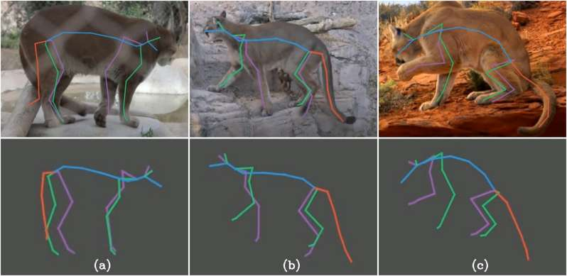

## Animal Paper Collection (Ongoing)

Recently, markerless animal **motion capture** and **3D reconstruction** attracts more and more attention in computer vision community. Inspired by remarkable techniques for markerless human motion capture, a few excellent literatures appear for animal modeling and reconstruction such as [SMAL](http://smal.is.tue.mpg.de/
) and [DeepLabCut](http://www.mousemotorlab.org/deeplabcut). However, there are still many challenges before computer vision methods are reliable in industry-grade for capturing natural motion of arbitary animals robustly and efficiently. 

Therefore, I contribute this repository to track every step towards the ultimate goal of high quality animal capture. If you want to add/remove an article, please send an email to [Liang An](https://anl13.github.io/)(al17 at mails dot tsinghua dot edu dot cn). Thank all the authors for their contribution and support.
 

<table><tbody> <tr> <td align="left" width=250>
</td>
<td align="left" width=550>Anipose: a toolkit for robust markerless 3D pose estimation 
<a href="https://github.com/lambdaloop">Pierre Karashchuk</a>, 
Katie L. Rupp, 
Evyn S. Dickinson, 
Elischa Sanders, 
<a href="https://www.salk.edu/scientist/eiman-azim/">Eiman Azim</a>, 
<a href="https://www.bingbrunton.com/">Bingni W. Brunton</a>, 
<a href="http://faculty.washington.edu/tuthill/">John C. Tuthill</a> 
In biorxiv 2020  
<a href="http://faculty.washington.edu/tuthill/docs/anipose.pdf">[Paper]</a> 
<a href="https://github.com/lambdaloop/anipose">[Project]</a>
</td></tr></tbody>

<tbody> <tr> <td align="left" width=250>
</td>
<td align="left" width=550>Automatic tracking of mouse social posture dynamics by 3D videography, deep learning and GPU-accelerated robust optimization 
Christian L. Ebbesen, 
<a href="http://froemkelab.med.nyu.edu/people">Robert C. Froemke</a> 
In biorxiv 2020  
<a href="https://www.biorxiv.org/content/biorxiv/early/2020/05/25/2020.05.21.109629.full.pdf">[Paper]</a> 
</td></tr></tbody>

<tbody> <tr> <td align="left" width=250>
</td>
<td align="left" width=550>Deep Graph Pose: a semi-supervised deep graphical model for improved animal pose tracking 
Anqi Wu, 
E. Kelly Buchanan, 
Matthew Whiteway, 
Michael Schartner, 
Guido Meijer, 
Jean-Paul Noel, 
Erica Rodriguez, 
Claire Everett, 
Amy Norovich, 
Evan Schaffer, 
Neeli Mishra, 
C. Daniel Salzman, 
Dora Angelaki, 
Andrés Bendesky, 
The International Brain Laboratory, 
John Cunningham, 
<a href="http://www.stat.columbia.edu/~liam/">Liam Paninski</a> 
In biorxiv 2020  
<a href="https://www.biorxiv.org/content/biorxiv/early/2020/08/22/2020.08.20.259705.full.pdf">[Paper]</a> 
<a href="https://drive.google.com/drive/folders/1W79W1m1JQNvL9bDoqBPhwOXqtyz0gc24?usp=sharing">[Project]</a>
</td></tr></tbody>

<tbody> <tr> <td align="left" width=250>
</td>
<td align="left" width=550>LiftPose3D, a deep learning-based approach for transforming 2D to 3D pose in laboratory animals 
Adam Gosztolai, 
Semih Gunel, 
Marco Pietro Abrate, 
Daniel Morales, 
Victor Lobato Rios, 
<a href="https://www.cs.ubc.ca/~rhodin/">Helge Rhodin</a>, 
Pascal Fua, 
<a href="https://www.epfl.ch/labs/ramdya-lab/">Pavan Ramdya</a> 
In biorxiv 2020  
<a href="https://www.biorxiv.org/content/10.1101/2020.09.18.292680v1.full.pdf+html">[Paper]</a> 
<a href="https://github.com/NeLy-EPFL/LiftPose3D">[Project]</a>
</td></tr></tbody>

<tbody> <tr> <td align="left" width=250>
</td>
<td align="left" width=550>Mapping Mouse Behavior with an Unsupervised Spatiotemporal Sequence Decomposition Framework 
Kang Huang, 
Yaning Han, 
Ke Chen, 
Hongli Pan, 
Wenling Yi, 
Xiaoxi Li, 
Siyuan Liu, 
<a href="https://www.researchgate.net/profile/Pengfei_Wei2">Pengfei Wei</a>, 
<a href="http://wanglab.siat.ac.cn/wanglab_en/index.php?a=lab_members">Liping Wang</a> 
In biorxiv 2020  
<a href="https://doi.org/10.1101/2020.09.14.295808">[Paper]</a> 
<a href="https://behavioratlas.tech/">[Project]</a>
</td></tr></tbody>

<tbody> <tr> <td align="left" width=250>
</td>
<td align="left" width=550>SLEAP: Multi-animal pose tracking 
<a href="https://biophysics.princeton.edu/people/talmo-pereira">Talmo D. Pereira</a>, 
Nathaniel Tabris, 
Junyu Li, 
Shruthi Ravindranath, 
Eleni S. Papadoyannis, 
Z. Yan Wang, 
David M. Turner, 
Grace McKenzie-Smith, 
Sarah D. Kocher, 
Annegret L. Falkner, 
Joshua W. Shaevitz, 
<a href="https://murthylab.princeton.edu/mala-murthy">Mala Murthy</a> 
In biorxiv 2020  
<a href="https://doi.org/10.1101/2020.08.31.276246">[Paper]</a> 
<a href="https://sleap.ai/">[Project]</a>
</td></tr></tbody>

<tbody> <tr> <td align="left" width=250>
</td>
<td align="left" width=550>TRex, a fast multi-animal tracking system with markerless identification, 2D body posture estimation and visual field reconstruction 
<a href="https://www.orn.mpg.de/person/45292/409958">Tristan Walter</a>, 
<a href="http://collectivebehaviour.com/">Iain D Couzin</a> 
In biorxiv 2020  
<a href="https://www.biorxiv.org/content/10.1101/2020.10.14.338996v1.full.pdf">[Paper]</a> 
</td></tr></tbody>

<tbody> <tr> <td align="left" width=250>
</td>
<td align="left" width=550>Multiview Supervision By Registration 
Yilun Zhang, 
<a href="https://www-users.cs.umn.edu/~hspark/">Hyun Soo Park</a> 
In WACV 2020  
<a href="https://arxiv.org/abs/1811.11251">[Paper]</a> 
</td></tr></tbody>

<tbody> <tr> <td align="left" width=250>
</td>
<td align="left" width=550>Facial expressions of emotion states and their neuronal correlates in mice 
Nejc Dolensek, 
Daniel A. Gehrlach, 
<a href="https://muckrack.com/alexandra-s-klein">Alexandra S. Klein</a>, 
<a href="https://www.neuro.mpg.de/gogolla">Nadine Gogolla</a> 
In Science 2020  
<a href="https://science.sciencemag.org/content/368/6486/89.full#:~:text=Facial%20expressions%20thus%20provide%20a%20means%20to%20infer,hormonal%2C%20and%20autonomic%20responses%20aimed%20at%20promoting%20survival.">[Paper]</a> 
</td></tr></tbody>

<tbody> <tr> <td align="left" width=250>
</td>
<td align="left" width=550>ZooBuilder: 2D and 3D Pose Estimation for Quadrupeds Using Synthetic Data 
Abassin Sourou Fangbemi, 
Yi Fei Lu, 
Mao Yuan Xu, 
Xiao Wu Luo, 
Alexis Rolland, 
Chedy Raissi 
In SCA (ACM Siggraph/Eurographics Symposium on Computer Animation) 2020  
<a href="https://export.arxiv.org/abs/2009.05389">[Paper]</a> 
</td></tr></tbody>

<tbody> <tr> <td align="left" width=250>
</td>
<td align="left" width=550>A Primer on Motion Capture with Deep Learning: Principles, Pitfalls and Perspectives 
<a href="http://www.people.fas.harvard.edu/~amathis/">Alexander Mathis</a>, 
Steffen Schneider, 
Jessy Lauer, 
<a href="https://scholar.harvard.edu/mwamoroso/home">Mackenzie W. Mathis</a> 
In Neuron 2020  
<a href="https://arxiv.org/pdf/2009.00564.pdf">[Paper]</a> 
</td></tr></tbody>

<tbody> <tr> <td align="left" width=250>
</td>
<td align="left" width=550>EthoLoop: automated closed-loop neuroethology in naturalistic environments 
Ali Nourizonoz, 
Robert Zimmermann, 
Chun Lum Andy Ho, 
Sebastien Pellat, 
Yannick Ormen, 
Clément Prévost-Solié, 
Gilles Reymond, 
Fabien Pifferi, 
Fabienne Aujard, 
Anthony Herrel, 
<a href="https://www.unige.ch/medecine/neuf/en/">Daniel Huber</a> 
In Nature Methods 2020  
<a href="https://pubmed.ncbi.nlm.nih.gov/32994566/">[Paper]</a> 
</td></tr></tbody>

<tbody> <tr> <td align="left" width=250>
</td>
<td align="left" width=550>OpenMonkeyStudio: Automated Markerless Pose Estimation in Freely Moving Macaques 
Praneet C. Bala, 
Benjamin R. Eisenreich, 
Seng Bum Michael Yoo, 
Benjamin Y. Hayden, 
<a href="https://www-users.cs.umn.edu/~hspark/">Hyun Soo Park</a>, 
<a href="https://med.umn.edu/bio/medical-discovery-teams/jan-zimmermann">Jan Zimmermann</a> 
In Nature Communications 2020  
<a href="https://www.biorxiv.org/content/10.1101/2020.01.31.928861v1">[Paper]</a> 
<a href="https://github.com/OpenMonkeyStudio">[Project]</a>
</td></tr></tbody>

<tbody> <tr> <td align="left" width=250>
</td>
<td align="left" width=550>3D Bird Reconstruction: a Dataset, Model, and Shape Recovery from a Single View 
<a href="https://www.ocf.berkeley.edu/~badger/">Marc Badger</a>, 
<a href="https://yufu-wang.github.io/">Yufu Wang</a>, 
<a href="https://www.seas.upenn.edu/~adarshm/">Adarsh Modh</a>, 
<a href="https://aperkes.github.io/">Ammon Perkes</a>, 
<a href="https://www.seas.upenn.edu/~nkolot/">Nikos Kolotouros</a>, 
<a href="http://pfrommer.us/">Bernd Pfrommer</a>, 
<a href="https://web.sas.upenn.edu/marcschmidtlab/pages/people/">Marc F. Schmidt</a>, 
<a href="https://www.cis.upenn.edu/~kostas/">Kostas Daniilidis</a> 
In ECCV 2020  
<a href="https://arxiv.org/abs/2008.06133">[Paper]</a> 
<a href="https://marcbadger.github.io/avian-mesh/">[Project]</a>
</td></tr></tbody>

<tbody> <tr> <td align="left" width=250>
</td>
<td align="left" width=550>Deep Cross-species Feature Learning for Animal Face Recognition via Residual Interspecies Equivariant Network 
Xiao Shi, 
Chenxue Yang, 
Xue Xia, 
<a href="http://aii.caas.cn/bsgk/ywbm/nyxxjzsyb/xzbm3/203034.htm">Xiujuan Chai</a> 
In ECCV 2020  
<a href="https://www.ecva.net/papers/eccv_2020/papers_ECCV/papers/123720664.pdf">[Paper]</a> 
</td></tr></tbody>

<tbody> <tr> <td align="left" width=250>
</td>
<td align="left" width=550>Shape and Viewpoint without Keypoints 
<a href="https://people.eecs.berkeley.edu/~shubham-goel/">Shubham Goel</a>, 
<a href="https://people.eecs.berkeley.edu/~kanazawa/">Angjoo Kanazawa</a>, 
<a href="https://people.eecs.berkeley.edu/~malik/">Jitendra Malik</a> 
In ECCV 2020  
<a href="https://arxiv.org/pdf/2007.10982.pdf">[Paper]</a> 
<a href="https://shubham-goel.github.io/ucmr/">[Project]</a>
</td></tr></tbody>

<tbody> <tr> <td align="left" width=250>
</td>
<td align="left" width=550>Who Left the Dogs Out? 3D Animal Reconstruction with Expectation Maximization in the Loop 
<a href="http://mi.eng.cam.ac.uk/~bjb56/">Benjamin Biggs</a>, 
<a href="https://uk.linkedin.com/in/ollie-boyne">Oliver Boyne</a>, 
<a href="http://www.jjcvision.com/">James Charles</a>, 
<a href="https://www.microsoft.com/en-us/research/people/awf/">Andrew Fitzgibbon</a>, 
<a href="https://mi.eng.cam.ac.uk/~cipolla/">Roberto Cipolla</a> 
In ECCV 2020  
<a href="https://arxiv.org/abs/2007.11110">[Paper]</a> 
</td></tr></tbody>

<tbody> <tr> <td align="left" width=250>
</td>
<td align="left" width=550>3D-ZeF: A 3D Zebrafish Tracking Benchmark Dataset 
<a href="https://vbn.aau.dk/en/persons/141158">Malte Pedersen</a>, 
Joakim Bruslund Haurum, 
<a href="https://vbn.aau.dk/en/persons/138111">Stefan Hein Bengtson</a>, 
<a href="https://vbn.aau.dk/en/persons/103282">Thomas B. Moeslund</a> 
In CVPR 2020  
<a href="https://openaccess.thecvf.com/content_CVPR_2020/papers/Pedersen_3D-ZeF_A_3D_Zebrafish_Tracking_Benchmark_Dataset_CVPR_2020_paper.pdf">[Paper]</a> 
<a href="https://vap.aau.dk/3d-zef/">[Project]</a>
</td></tr></tbody>

<tbody> <tr> <td align="left" width=250>
</td>
<td align="left" width=550>AnimalWeb: A Large-Scale Hierarchical Dataset of Annotated Animal Faces 
Muhammad Haris Khan, 
John McDonagh, 
Salman Khan, 
Muhammad Shahabuddin, 
Aditya Arora, 
Fahad Shahbaz Khan, 
Ling Shao, 
<a href="http://www.cs.nott.ac.uk/~pszyt/">Georgios Tzimiropoulos</a> 
In CVPR 2020  
<a href="https://arxiv.org/abs/1909.04951">[Paper]</a> 
<a href="https://fdmaproject.wordpress.com/">[Project]</a>
</td></tr></tbody>

<tbody> <tr> <td align="left" width=250>
</td>
<td align="left" width=550>Articulation Aware Canonical Surface Mapping 
<a href="https://nileshkulkarni.github.io/">Nilesh Kulkarni</a>, 
<a href="http://www.cs.cmu.edu/~abhinavg/">Abhinav Gupta</a>, 
<a href="http://web.eecs.umich.edu/~fouhey/">David F. Fouhey</a>, 
<a href="https://shubhtuls.github.io/">Shubham Tulsiani</a> 
In CVPR 2020  
<a href="https://arxiv.org/pdf/2004.00614.pdf">[Paper]</a> 
<a href="https://nileshkulkarni.github.io/acsm/">[Project]</a>
</td></tr></tbody>

<tbody> <tr> <td align="left" width=250>
</td>
<td align="left" width=550>Deformation-aware Unpaired Image Translation for Pose Estimation on Laboratory Animals 
<a href="https://siyliepfl.github.io/">Siyuan Li</a>, 
<a href="https://semihgunel.com/">Semih Gunel</a>, 
Mirela Ostrek, 
Pavan Ramdya, 
Pascal Fua, 
<a href="https://www.cs.ubc.ca/~rhodin/">Helge Rhodin</a> 
In CVPR 2020  
<a href="https://openaccess.thecvf.com/content_CVPR_2020/papers/Li_Deformation-Aware_Unpaired_Image_Translation_for_Pose_Estimation_on_Laboratory_Animals_CVPR_2020_paper.pdf">[Paper]</a> 
<a href="https://github.com/siyliepfl/deformation-aware-unpaired-image-translation">[Project]</a>
</td></tr></tbody>

<tbody> <tr> <td align="left" width=250>
</td>
<td align="left" width=550>Learning from Synthetic Animals 
Jiteng Mu, 
<a href="https://weichaoqiu.com/">Weichao Qiu</a>, 
<a href="https://www.cs.jhu.edu/hager/">Gregory Hager</a>, 
<a href="http://www.cs.jhu.edu/~ayuille/">Alan Yuille</a> 
In CVPR 2020 (<b>oral</b>) 
<a href="https://arxiv.org/abs/1912.08265">[Paper]</a> 
<a href="https://github.com/JitengMu/Learning-from-Synthetic-Animals">[Project]</a>
</td></tr></tbody>

<tbody> <tr> <td align="left" width=250>
</td>
<td align="left" width=550>RGBD-Dog: Predicting Canine Pose from RGBD Sensors 
<a href="https://researchportal.bath.ac.uk/en/persons/sinead-kearney">Sinead Kearney</a>, 
<a href="https://wbli.me/">Wenbin Li</a>, 
Martin Parsons, 
<a href="http://kimki.unist.ac.kr/">Kwang In Kim</a>, 
<a href="http://www.cs.bath.ac.uk/~dpc/">Darren Cosker</a> 
In CVPR 2020  
<a href="https://openaccess.thecvf.com/content_CVPR_2020/papers/Kearney_RGBD-Dog_Predicting_Canine_Pose_from_RGBD_Sensors_CVPR_2020_paper.pdf">[Paper]</a> 
<a href="https://github.com/CAMERA-Bath/RGBD-Dog#:~:text=%20RGBD-Dog%3A%20Predicting%20Canine%20Pose%20from%20RGBD%20Sensors,5%20Citation.%20%206%20Contact.%20%20More%20">[Project]</a>
</td></tr></tbody>

<tbody> <tr> <td align="left" width=250>
</td>
<td align="left" width=550>Transferring Dense Pose to Proximal Animal Classes 
<a href="https://gdude.de/">Artsiom Sanakoyeu</a>, 
<a href="https://research.fb.com/people/khalidov-vasil/">Vasil Khalidov</a>, 
<a href="https://www.maureenmccarthyphd.com/">Maureen S. McCarthy</a>, 
<a href="https://www.robots.ox.ac.uk/~vedaldi/">Andrea Vedaldi</a>, 
<a href="https://nneverova.github.io/">Natalia Neverova</a> 
In CVPR 2020  
<a href="https://arxiv.org/abs/2003.00080">[Paper]</a> 
<a href="https://gdude.de/densepose-evolution/">[Project]</a>
</td></tr></tbody>

<tbody> <tr> <td align="left" width=250>
</td>
<td align="left" width=550>Unsupervised Learning of Probably Symmetric Deformable 3D Objects from Images in the Wild 
<a href="https://elliottwu.com/">Shangzhe Wu</a>, 
<a href="https://chrirupp.github.io/">Christian Rupprecht</a>, 
<a href="http://www.robots.ox.ac.uk/~vedaldi/">Andrea Vedaldi</a> 
In CVPR 2020 (<b>Best Paper Award</b>) 
<a href="https://arxiv.org/abs/1911.11130">[Paper]</a> 
<a href="https://elliottwu.com/projects/unsup3d/">[Project]</a>
</td></tr></tbody>

<tbody> <tr> <td align="left" width=250>
</td>
<td align="left" width=550>DeepPoseKit, a software toolkit for fast and robust animal pose estimation using deep learning 
<a href="https://jakegraving.com/files/cv/jacob_graving_cv.pdf">Jacob M. Graving</a>, 
<a href="https://www.danielchae.com/">Daniel Chae</a>, 
Hemal Naik, 
Liang Li, 
Benjamin Koger, 
<a href="http://www.blaircostelloe.com/">Blair R. Costelloe</a>, 
<a href="http://collectivebehaviour.com/people/couzin-iain/#:~:text=Iain%20Couzin%20is%20Director%20of%20the%20Max%20Planck,Fellow%20in%20the%20Sciences%20at%20Balliol%20College%2C%20Oxford.">Iain D. Couzin</a> 
In eLife 2019  
<a href="https://www.biorxiv.org/content/10.1101/620245v7">[Paper]</a> 
<a href="https://github.com/jgraving/deepposekit">[Project]</a>
</td></tr></tbody>

<tbody> <tr> <td align="left" width=250>
</td>
<td align="left" width=550>Using DeepLabCut for 3D markerless pose estimation across species and behaviors 
Tanmay Nath, 
<a href="http://www.people.fas.harvard.edu/~amathis/">Alexander Mathis</a>, 
An Chi Chen, 
Amir Patel, 
<a href="http://bethgelab.org/">Matthias Bethge</a>, 
<a href="https://scholar.harvard.edu/mwamoroso/home">Mackenzie Weygandt Mathis</a> 
In Nature Protocols 2019  
<a href="https://www.nature.com/articles/s41596-019-0176-0">[Paper]</a> 
<a href="https://github.com/DeepLabCut/DeepLabCut/blob/master/README.md">[Project]</a>
</td></tr></tbody>

<tbody> <tr> <td align="left" width=250>
</td>
<td align="left" width=550>Fast animal pose estimation using deep neural networks 
<a href="https://biophysics.princeton.edu/people/talmo-pereira">Talmo D. Pereira</a>, 
<a href="https://olveczkylab.oeb.harvard.edu/people/diego-etiony-aldarondo">Diego E. Aldarondo</a>, 
Lindsay Willmore, 
<a href="Mikhail Kislin">Mikhail Kislin</a>, 
<a href="https://scholar.princeton.edu/wanglab/people/samuel-s-h-wang">Samuel S.-H. Wang</a>, 
<a href="https://murthylab.princeton.edu/mala-murthy">Mala Murthy</a>, 
<a href="https://molbiod.princeton.edu/people/joshua-w-shaevitz">Joshua W. Shaevitz</a> 
In Nature Methods 2019  
<a href="https://www.nature.com/articles/s41592-018-0234-5">[Paper]</a> 
<a href="https://github.com/talmo/leap">[Project]</a>
</td></tr></tbody>

<tbody> <tr> <td align="left" width=250>
</td>
<td align="left" width=550>idtracker.ai: tracking all individuals in small or large collectives of unmarked animals 
<a href="https://www.researchgate.net/profile/Francisco_Romero-Ferrero">Francisco Romero-Ferrero</a>, 
Mattia G. Bergomi, 
Robert C. Hinz, 
Francisco J. H. Heras, 
<a href="http://www.neuro.fchampalimaud.org/en/person/276/">Gonzalo G. de Polavieja</a> 
In Nature Methods 2019 (<b>Brief Communication</b>) 
<a href="https://arxiv.org/abs/1803.04351">[Paper]</a> 
<a href="https://idtrackerai.readthedocs.io/en/latest/">[Project]</a>
</td></tr></tbody>

<tbody> <tr> <td align="left" width=250>
</td>
<td align="left" width=550>Real-time analysis of the behaviour of groups of mice via a depth-sensing camera and machine learning 
<a href="https://research.pasteur.fr/en/member/fabrice-de-chaumont/">Fabrice de Chaumont</a>, 
Elodie Ey, 
Nicolas Torquet, 
Thibault Lagache, 
Stéphane Dallongeville, 
Albane Imbert, 
Thierry Legou, 
Anne-Marie Le Sourd, 
Philippe Faure, 
<a href="https://research.pasteur.fr/en/member/thomas-bourgeron/">Thomas Bourgeron</a>, 
<a href="https://research.pasteur.fr/en/member/jean-christophe-olivo-marin/">Jean-Christophe Olivo-Marin</a> 
In Nature Biomedical Engineering 2019  
<a href="https://www.nature.com/articles/s41551-019-0396-1">[Paper]</a> 
<a href="https://edspace.american.edu/openbehavior/2018/12/05/live-mouse-tracker/">[Project]</a>
</td></tr></tbody>

<tbody> <tr> <td align="left" width=250>
</td>
<td align="left" width=550>Canonical Surface Mapping via Geometric Cycle Consistency 
<a href="https://nileshkulkarni.github.io/">Nilesh Kulkarni</a>, 
<a href="http://www.cs.cmu.edu/~abhinavg/">Abhinav Gupta</a>, 
<a href="https://shubhtuls.github.io/">Shubham Tulsiani</a> 
In ICCV 2019  
<a href="https://arxiv.org/pdf/1907.10043.pdf">[Paper]</a> 
<a href="https://nileshkulkarni.github.io/csm/">[Project]</a>
</td></tr></tbody>

<tbody> <tr> <td align="left" width=250>
</td>
<td align="left" width=550>Cross-Domain Adaptation for Animal Pose Estimation 
<a href="http://www.jinkuncao.com/">Jinkun Cao</a>, 
Hongyang Tang, 
<a href="https://fang-haoshu.github.io/">Hao-Shu Fang</a>, 
<a href="http://xiaoyongshen.me/">Xiaoyong Shen</a>, 
<a href="https://www.mvig.org/">Cewu Lu</a>, 
Yu-Wing Tai 
In ICCV 2019 (<b>oral</b>) 
<a href="https://arxiv.org/abs/1908.05806">[Paper]</a> 
<a href="http://www.jinkuncao.com/animalpose">[Project]</a>
</td></tr></tbody>

<tbody> <tr> <td align="left" width=250>
</td>
<td align="left" width=550>MONET: Multiview Semi-supervised Keypoint Detection via Epipolar Divergence 
Yuan Yao, 
Yasamin Jafarian, 
<a href="https://www-users.cs.umn.edu/~hspark/">Hyun Soo Park</a> 
In ICCV 2019  
<a href="https://arxiv.org/abs/1806.00104">[Paper]</a> 
</td></tr></tbody>

<tbody> <tr> <td align="left" width=250>
</td>
<td align="left" width=550>Three-D Safari: Learning to Estimate Zebra Pose, Shape, and Texture from Images "In the Wild" 
<a href="https://ps.is.tuebingen.mpg.de/person/szuffi">Silvia Zuffi</a>, 
<a href="https://people.eecs.berkeley.edu/~kanazawa/">Angjoo Kanazawa</a>, 
<a href="https://www.cs.uic.edu/~tanyabw/">Tanya Berger-Wolf</a>, 
<a href="https://ps.is.tuebingen.mpg.de/person/black">Michael J. Black</a> 
In ICCV 2019  
<a href="https://arxiv.org/abs/1908.07201">[Paper]</a> 
<a href="https://github.com/silviazuffi/smalst">[Project]</a>
</td></tr></tbody>

<tbody> <tr> <td align="left" width=250>
</td>
<td align="left" width=550>DeepLabCut: markerless pose estimation of user-defined body parts with deep learning 
<a href="http://www.people.fas.harvard.edu/~amathis/">Alexander Mathis</a>, 
Pranav Mamidanna, 
<a href="https://muckrack.com/kevin-m-cury">Kevin M. Cury</a>, 
Taiga Abe, 
<a href="https://vnmurthylab.org/">Venkatesh N. Murthy</a>, 
<a href="https://scholar.harvard.edu/mwamoroso/home">Mackenzie Weygandt Mathis</a>, 
<a href="http://bethgelab.org/">Matthias Bethge</a> 
In Nature Neuroscience 2018  
<a href="https://www.nature.com/articles/s41593-018-0209-y">[Paper]</a> 
<a href="http://www.mousemotorlab.org/deeplabcut">[Project]</a>
</td></tr></tbody>

<tbody> <tr> <td align="left" width=250>
</td>
<td align="left" width=550>Learning Category-Specific Mesh Reconstruction from Image Collections 
<a href="https://people.eecs.berkeley.edu/~kanazawa/">Angjoo Kanazawa</a>, 
<a href="https://shubhtuls.github.io/">Shubham Tulsiani</a>, 
<a href="https://people.eecs.berkeley.edu/~efros/">Alexei A. Efros</a>, 
<a href="https://people.eecs.berkeley.edu/~malik/">Jitendra Malik</a> 
In ECCV 2018  
<a href="https://people.eecs.berkeley.edu/~kanazawa/papers/cmr_camera_ready.pdf">[Paper]</a> 
<a href="https://akanazawa.github.io/cmr/">[Project]</a>
</td></tr></tbody>

<tbody> <tr> <td align="left" width=250>
</td>
<td align="left" width=550>Lions and Tigers and Bears: Capturing Non-Rigid, 3D, Articulated Shape from Images 
<a href="https://ps.is.tuebingen.mpg.de/person/szuffi">Silvia Zuffi</a>, 
<a href="https://people.eecs.berkeley.edu/~kanazawa/">Angjoo Kanazawa</a>, 
<a href="https://ps.is.tuebingen.mpg.de/person/black">Michael J. Black</a> 
In CVPR 2018 (<b>spotlight</b>) 
<a href="http://files.is.tue.mpg.de/black/papers/zuffiCVPR2018.pdf">[Paper]</a> 
<a href="http://smalr.is.tue.mpg.de/">[Project]</a>
</td></tr></tbody>

<tbody> <tr> <td align="left" width=250>
</td>
<td align="left" width=550>Creatures great and SMAL: Recovering the shape and motion of animals from video 
<a href="http://mi.eng.cam.ac.uk/~bjb56/">Benjamin Biggs</a>, 
<a href="http://mi.eng.cam.ac.uk/~tr346/">Thomas Roddick</a>, 
<a href="https://www.microsoft.com/en-us/research/people/awf/">Andrew Fitzgibbon</a>, 
<a href="https://mi.eng.cam.ac.uk/~cipolla/">Roberto Cipolla</a> 
In ACCV 2018 (<b>oral</b>) 
<a href="https://arxiv.org/abs/1811.05804">[Paper]</a> 
</td></tr></tbody>

<tbody> <tr> <td align="left" width=250>
</td>
<td align="left" width=550>Single-View 3D Reconstruction of Animals 
<a href="https://people.eecs.berkeley.edu/~kanazawa/">Angjoo Kanazawa</a> 
In Ph.D Thesis 2017  
<a href="https://people.eecs.berkeley.edu/~kanazawa/papers/thesis.pdf">[Paper]</a> 
</td></tr></tbody>

<tbody> <tr> <td align="left" width=250>
</td>
<td align="left" width=550>3D Menagerie: Modeling the 3D shape and pose of animals 
<a href="https://ps.is.tuebingen.mpg.de/person/szuffi">Silvia Zuffi</a>, 
<a href="https://people.eecs.berkeley.edu/~kanazawa/">Angjoo Kanazawa</a>, 
<a href="https://www.cs.umd.edu/~djacobs/">David W. Jacobs</a>, 
<a href="https://ps.is.tuebingen.mpg.de/person/black">Michael J. Black</a> 
In CVPR 2017 (<b>spotlight</b>) 
<a href="https://people.eecs.berkeley.edu/~kanazawa/papers/cvpr17_menagerie_camready.pdf">[Paper]</a> 
<a href="http://smal.is.tue.mpg.de/">[Project]</a>
</td></tr></tbody>

<tbody> <tr> <td align="left" width=250>
</td>
<td align="left" width=550>3D Pose Estimation of Flying Animals in Multi-view Video Datasets 
<a href="http://people.bu.edu/breslav/">Mikhail Breslav</a> 
In Ph.D Thesis 2016  
<a href="https://open.bu.edu/handle/2144/19720">[Paper]</a> 
</td></tr></tbody>

<tbody> <tr> <td align="left" width=250>
</td>
<td align="left" width=550>Learning 3D Deformation of Animals from 2D Images 
<a href="https://people.eecs.berkeley.edu/~kanazawa/">Angjoo Kanazawa</a>, 
<a href="https://shaharkov.github.io/">Shahar Kovalsky</a>, 
<a href="http://www.weizmann.ac.il/math/ronen/home">Ronen Basri</a>, 
<a href="https://www.cs.umd.edu/~djacobs/">David W. Jacobs</a> 
In Eurographics 2016 (<b>Günter Enderle Best Paper Award</b>) 
<a href="https://people.eecs.berkeley.edu/~kanazawa/papers/cat_eg2016.pdf">[Paper]</a> 
<a href="https://github.com/akanazawa/catdeform">[Project]</a>
</td></tr></tbody>

<tbody> <tr> <td align="left" width=250>
</td>
<td align="left" width=550>idTracker: Tracking individuals in a group by automatic identification of unmarked animals 
Alfonso Pérez-Escudero, 
Julián Vicente-Page, 
Robert C Hinz, 
Sara Arganda, 
<a href="http://www.neuro.fchampalimaud.org/en/person/276/">Gonzalo G de Polavieja1</a> 
In Nature Methods 2014  
<a href="https://www.nature.com/articles/nmeth.2994">[Paper]</a> 
<a href="http://www.idtracker.es/">[Project]</a>
</td></tr></tbody>

</table>
 

Last updated in Oct 2020
 

This repository is inspired by [Cat Papers](https://github.com/junyanz/CatPapers) with some code borrowed from it. Thank [Junyan Zhu](https://github.com/junyanz/) for his sharing!