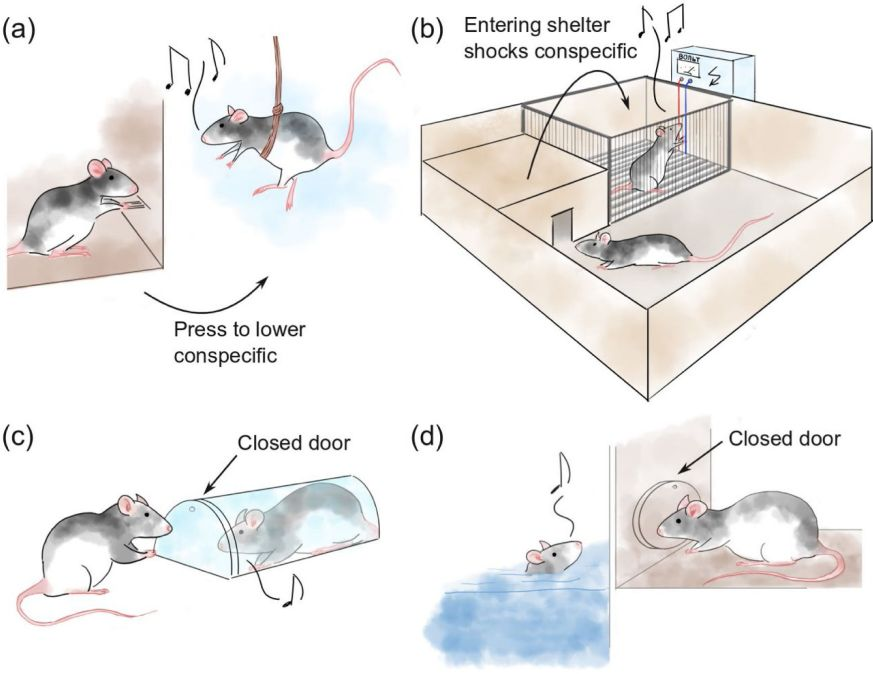

## Animal Paper Collection (Ongoing)
[2022.01.02] To make it easy to track, I sort the papers using the timepoint I find them (not publication time), and add label badges to show paper features. 

[2021.11.28] I recommend [MMPose](https://github.com/open-mmlab/mmpose) for 2D animal pose estimation. It has collected various kinds of [datasets](https://github.com/open-mmlab/mmpose/blob/master/docs/tasks/2d_animal_keypoint.md).

[2021.07.16] I recommend CV4Animal workshop in CVPR 2021 (https://www.cv4animals.com/) because it is a good collection of recent advances in animal pose estimation area! 

Recently, markerless animal **motion capture** and **3D reconstruction** attracts more and more attention in computer vision community. Inspired by remarkable techniques for markerless human motion capture, a few excellent literatures appear for animal modeling and reconstruction such as [SMAL](http://smal.is.tue.mpg.de/
) and [DeepLabCut](http://www.mousemotorlab.org/deeplabcut). However, there is still a long way before computer vision methods could capture natural motion of arbitary animals in industrial-grade. 

Therefore, I contribute this repository to track every step towards the ultimate goal of high quality animal capture. If you want to add/remove an article, please send an email to [Liang An](https://anl13.github.io/)(al17 at mails dot tsinghua dot edu dot cn). Thank all the authors for their contribution and support.

 

<table><tbody> <tr> <td align="left" width=250>
</td>
<td align="left" width=550><em>Multi-animal pose estimation, identification and tracking with DeepLabCut</em> 
Jessy Lauer, 
Mu Zhou, 
Shaokai Ye, 
William Menegas, 
Steffen Schneider, 
Tanmay Nath, 
Mohammed Mostafizur Rahman, 
Valentina Di Santo, 
Daniel Soberanes, 
Guoping Feng, 
Venkatesh N. Murthy, 
George Lauder, 
Catherine Dulac, 
Mackenzie Weygandt Mathis, 
<a href="https://www.mathislab.org/people">Alexander Mathis</a> 
In Nature Methods 2022  
 

</td></tr></tbody>

<tbody> <tr> <td align="left" width=250>
</td>
<td align="left" width=550><em>SLEAP: A deep learning system for multi-animal pose tracking</em> 
<a href="https://biophysics.princeton.edu/people/talmo-pereira">Talmo D. Pereira</a>, 
Nathaniel Tabris, 
Arie Matsliah, 
David M. Turner, 
Junyu Li, 
Shruthi Ravindranath, 
Eleni S. Papadoyannis, 
Edna Normand, 
David S. Deutsch, 
Z. Yan Wang, 
Grace McKenzie-Smith, 
Catalin C. Mitelut, 
Marielisa Diez Castro, 
John D'Uva, 
Mikhail Kislin, 
<a href="https://www.saneslab.com/">Dan H. Sanes</a>, 
<a href="https://lsi.princeton.edu/sarah-d-kocher">Sarah D. Kocher</a>, 
<a href="https://scholar.princeton.edu/wanglab/about">Samuel S.-H. Wang</a>, 
<a href="https://www.falknerlab.com/">Annegret L. Falkner</a>, 
<a href="https://molbio.princeton.edu/people/joshua-w-shaevitz">Joshua W. Shaevitz</a>, 
<a href="https://murthylab.princeton.edu/mala-murthy">Mala Murthy</a> 
In Nature Methods 2022  
 

</td></tr></tbody>

<tbody> <tr> <td align="left" width=250>
</td>
<td align="left" width=550><em>BARC: Learning to Regress 3D Dog Shape from Images by Exploiting Breed Information</em> 
<a href="https://ps.is.mpg.de/person/nrueegg">Nadine Ruegg</a>, 
<a href="https://ps.is.mpg.de/person/szuffi">Silvia Zuffi</a>, 
Konrad Schindler, 
<a href="https://ps.is.mpg.de/person/black">Michael J. Black</a> 
In CVPR 2022  
 

</td></tr></tbody>

<tbody> <tr> <td align="left" width=250>
</td>
<td align="left" width=550><em>Artemis: Articulated Neural Pets with Appearance and Motion Synthesis</em> 
Haimin Luo, 
Teng Xu, 
Yuheng Jiang, 
Chenglin Zhou, 
Qiwei Qiu, 
Yingliang Zhang, 
Wei Yang, 
<a href="https://www.xu-lan.com/">Lan Xu</a>, 
<a href="https://vic.shanghaitech.edu.cn/vrvc/en/people/jingyi-yu/">Jingyi Yu</a> 
In arxiv 2022  
 
</td></tr></tbody>

<tbody> <tr> <td align="left" width=250>
</td>
<td align="left" width=550><em>Automatic mapping of multiplexed social receptive fields by deep learning and GPU-accelerated 3D videography</em> 
Christian L. Ebbesen, 
<a href="http://froemkelab.med.nyu.edu/people">Robert C. Froemke</a> 
In Nature Communications 2022  
 

</td></tr></tbody>

<tbody> <tr> <td align="left" width=250>
</td>
<td align="left" width=550><em>BANMo: Building Animatable 3D Neural Models from Many Casual Videos</em> 
<a href="https://gengshan-y.github.io/">Gengshan Yang</a>, 
<a href="https://minhpvo.github.io/">Minh Vo</a>, 
<a href="https://nneverova.github.io/">Natalia Neverova</a>, 
<a href="https://www.cs.cmu.edu/~deva/">Deva Ramanan</a>, 
<a href="https://www.robots.ox.ac.uk/~vedaldi/">Andrea Vedaldi</a>, 
<a href="https://jhugestar.github.io/">Hanbyul Joo</a> 
In CVPR 2022  
 

</td></tr></tbody>

<tbody> <tr> <td align="left" width=250>
</td>
<td align="left" width=550><em>Overcoming the Domain Gap in Neural Action Representations</em> 
Semih Gunel, 
Florian Aymanns, 
Sina Honari, 
Pavan Ramdya, 
Pascal Fua 
In arxiv 2021  
 
</td></tr></tbody>

<tbody> <tr> <td align="left" width=250>
</td>
<td align="left" width=550><em>Incremental Learning for Animal Pose Estimation using RBF k-DPP</em> 
Gaurav Kumar Nayak, 
<a href="https://het-shah.github.io/">Het Shah</a>, 
<a href="http://visual-computing.in/wp-content/uploads/2017/08/anirban-chakraborty.html">Anirban Chakraborty</a> 
In arxiv 2021  
 
</td></tr></tbody>

<tbody> <tr> <td align="left" width=250>
</td>
<td align="left" width=550><em>Muti-view Mouse Social Behaviour Recognition with Deep Graphic Model</em> 
Zheheng Jiang, 
Feixiang Zhou, 
Aite Zhao, 
Xin Li, 
Ling Li, 
<a href="https://dl.acm.org/profile/81100159571">Dacheng Tao</a>, 
<a href="http://www.dcs.bbk.ac.uk/~xuelong/">Xuelong Li</a>, 
<a href="https://www2.le.ac.uk/departments/informatics/people/huiyu-zhou">Huiyu Zhou</a> 
In TIP 2021  
 
</td></tr></tbody>

<tbody> <tr> <td align="left" width=250>
</td>
<td align="left" width=550><em>MouseVenue3D: A Markerless Three-Dimension Behavioral Tracking System for Matching Two-Photon Brain Imaging in Free-Moving Mice</em> 
Yaning Han, 
Kang Huang, 
Ke Chen, 
Hongli Pan, 
Furong Ju, 
Yueyue Long, 
Gao Gao, 
Runlong Wu, 
Aimin Wang, 
Liping Wang, 
Pengfei Wei 
In Neuroscience Bulletin 2021  
 
</td></tr></tbody>

<tbody> <tr> <td align="left" width=250>
</td>
<td align="left" width=550><em>Multi-camera real-time threedimensional tracking of multiple flying animals</em> 
<a href="https://strawlab.org/">Andrew D. Straw</a>, 
Kristin Branson, 
Titus R. Neumann, 
<a href="https://www.bbe.caltech.edu/people/michael-h-dickinson">Michael H. Dickinson</a> 
In J. R. Soc. Interface 2011  
 
</td></tr></tbody>

<tbody> <tr> <td align="left" width=250>
</td>
<td align="left" width=550><em>The Mouse Action Recognition System (MARS) software pipeline for automated analysis of social behaviors in mice</em> 
Cristina Segalin, 
Jalani Williams, 
Tomomi Karigo, 
May Hui, 
Moriel Zelikowsky, 
Jennifer J Sun, 
Pietro Perona, 
David J Anderson, 
Ann Kennedy 
In eLife 2021  
 

</td></tr></tbody>

<tbody> <tr> <td align="left" width=250>
</td>
<td align="left" width=550><em>Self-Supervised Keypoint Discovery in Behavioral Videos</em> 
Jennifer J. Sun, 
Serim Ryou, 
Roni Goldshmid, 
Brandon Weissbourd, 
John Dabiri, 
David J. Anderson, 
Ann Kennedy, 
Yisong Yue, 
Pietro Perona 
In arxiv 2021  
 
</td></tr></tbody>

<tbody> <tr> <td align="left" width=250>
</td>
<td align="left" width=550><em>The Multi-Agent Behavior Dataset: Mouse Dyadic Social Interactions</em> 
Jennifer J. Sun, 
Tomomi Karigo, 
Dipam Chakraborty, 
Sharada P. Mohanty, 
David J. Anderson, 
Pietro Perona, 
Yisong Yue, 
Ann Kennedy 
In NeurIPS (Dataset & Benchmarks) 2021  
 

</td></tr></tbody>

<tbody> <tr> <td align="left" width=250>
</td>
<td align="left" width=550><em>Task Programming: Learning Data Efficient Behavior Representations</em> 
Jennifer J. Sun, 
Ann Kennedy, 
Eric Zhan, 
David J. Anderson, 
Yisong Yue, 
Pietro Perona 
In CVPR 2021 (<b>Best Student Paper Award</b>) 
 

</td></tr></tbody>

<tbody> <tr> <td align="left" width=250>
</td>
<td align="left" width=550><em>Coarse-to-fine Animal Pose and Shape Estimation</em> 
<a href="https://chaneyddtt.github.io/">Chen Li</a>, 
<a href="https://www.comp.nus.edu.sg/~leegh/">Gim Hee Lee</a> 
In NeurIPS 2021  
 
</td></tr></tbody>

<tbody> <tr> <td align="left" width=250>
</td>
<td align="left" width=550><em>Hierarchical organization of rhesus macaque behavior</em> 
Benjamin Voloh, 
Benjamin R. Eisenreich, 
David J-N. Maisson, 
R. Becket Ebitz, 
Hyun Soo Park, 
Benjamin Y. Hayden, 
Jan Zimmermann 
In biorxiv 2021  
 
</td></tr></tbody>

<tbody> <tr> <td align="left" width=250>
</td>
<td align="left" width=550><em>Leaving Flatland: Advances in 3D behavioral measurement</em> 
<a href="https://neurotree.org/neurotree/peopleinfo.php?pid=663448">Jesse D. Marshall</a>, 
Tianqing Li, 
Joshua H. Wu, 
Timothy W. Dunn 
In arxiv 2021  
 
</td></tr></tbody>

<tbody> <tr> <td align="left" width=250>
</td>
<td align="left" width=550><em>Unified 3D Mesh Recovery of Humans and Animals by Learning Animal Exercise</em> 
Kim Youwang, 
Kim Ji-Yeon, 
Kyungdon Joo, 
Tae-Hyun Oh 
In BMVC 2021  
 
</td></tr></tbody>

<tbody> <tr> <td align="left" width=250>
</td>
<td align="left" width=550><em>Anipose: a toolkit for robust markerless 3D pose estimation</em> 
<a href="https://github.com/lambdaloop">Pierre Karashchuk</a>, 
Katie L. Rupp, 
Evyn S. Dickinson, 
SarahWalling-Bell, 
Elischa Sanders, 
<a href="https://www.salk.edu/scientist/eiman-azim/">Eiman Azim</a>, 
<a href="https://www.bingbrunton.com/">Bingni W. Brunton</a>, 
<a href="http://faculty.washington.edu/tuthill/">John C. Tuthill</a> 
In Cell Reports (Resource) 2021  
 

</td></tr></tbody>

<tbody> <tr> <td align="left" width=250>
</td>
<td align="left" width=550><em>Multimodal-based Scene-Aware Framework for Aquatic Animal Segmentation</em> 
Minh-Quan Le, 
Trung-Nghia Le, 
Tam V. Nguyen, 
Isao Echizen, 
Minh-Triet Tran 
In arxiv 2021  
 
</td></tr></tbody>

<tbody> <tr> <td align="left" width=250>
</td>
<td align="left" width=550><em>Learning interaction rules from multi-animal trajectories via augmented behavioral models</em> 
Keisuke Fujii, 
Naoya Takeishi, 
Kazushi Tsutsui, 
Emyo Fujioka, 
Nozomi Nishiumi, 
Ryoya Tanaka, 
Mika Fukushiro, 
Kaoru Ide, 
Hiroyoshi Kohno, 
Ken Yoda, 
Susumu Takahashi, 
Shizuko Hiryu, 
<a href="http://en.kawahara-lab.org/~kawahara/">Yoshinobu Kawahara</a> 
In NeurIPS 2021  
 
</td></tr></tbody>

<tbody> <tr> <td align="left" width=250>
</td>
<td align="left" width=550><em>The PAIR-R24M Dataset for Multi-animal 3D Pose Estimation</em> 
Jesse Marshall, 
Ugne Klibaite, 
Amanda Gellis, 
Diego Aldarondo, 
<a href="https://oeb.harvard.edu/people/bence-p-olveczky">Bence O¨lveczky</a>, 
Tim Dunn 
In NeurIPS 2021  
 

</td></tr></tbody>

<tbody> <tr> <td align="left" width=250>
</td>
<td align="left" width=550><em>Across-animal odor decoding by probabilistic manifold alignment</em> 
Pedro Herrero-Vidal, 
Dmitry Rinberg, 
<a href="https://as.nyu.edu/content/nyu-as/as/faculty/cristina-savin.html">Cristina Savin</a> 
In NeurIPS 2021  
 
</td></tr></tbody>

<tbody> <tr> <td align="left" width=250>
</td>
<td align="left" width=550><em>4DComplete: Non-Rigid Motion Estimation Beyond the Observable Surface</em> 
Yang Li, 
Hikari Takehara, 
Takafumi Taketomi, 
Bo Zheng, 
<a href="https://niessnerlab.org/">Matthias Nießner</a> 
In ICCV 2021  
 

</td></tr></tbody>

<tbody> <tr> <td align="left" width=250>
</td>
<td align="left" width=550><em>DensePose 3D: Lifting Canonical Surface Maps of Articulated Objects to the Third Dimension</em> 
Roman Shapovalov, 
David Novotny, 
Benjamin Graham, 
Patrick Labatut, 
Andrea Vedaldi 
In ICCV 2021  
 
</td></tr></tbody>

<tbody> <tr> <td align="left" width=250>
</td>
<td align="left" width=550><em>Body language signals for rodent social communication</em> 
Christian L. Ebbesen, 
<a href="https://med.nyu.edu/faculty/robert-c-froemke">Robert C. Froemke</a> 
In Current Opinion in Neurobiology 2021  
 
</td></tr></tbody>

<tbody> <tr> <td align="left" width=250>
</td>
<td align="left" width=550><em>coding of facial expressions of pain in the laboratory mouse</em> 
Dale J Langford, 
Andrea L Bailey, 
Mona Lisa Chanda, 
Sarah E Clarke, 
Tanya E Drummond, 
Stephanie Echols, 
Sarah Glick, 
Joelle Ingrao, 
Tammy Klassen-Ross, 
Michael L LaCroix-Fralish, 
Lynn Matsumiya, 
Robert E Sorge, 
Susana G Sotocinal, 
John M Tabaka, 
David Wong, 
Arn M J M van den Maagdenberg, 
Michel D Ferrari, 
Kenneth D Craig, 
Jeffrey S Mogil 
In Nature Methods (brief communications) 2010  
 
</td></tr></tbody>

<tbody> <tr> <td align="left" width=250>
</td>
<td align="left" width=550><em>AP-10K: A Benchmark for Animal Pose Estimation in the Wild</em> 
Hang Yu, 
Yufei Xu, 
Jing Zhang, 
Wei Zhao, 
Ziyu Guan, 
<a href="https://www.sydney.edu.au/engineering/about/our-people/academic-staff/dacheng-tao.html">Dacheng Tao</a> 
In NeurIPS 2021  
 

</td></tr></tbody>

<tbody> <tr> <td align="left" width=250>
</td>
<td align="left" width=550><em>DeepImageJ: A user-friendly environment to run deep learning models in ImageJ</em> 
Estibaliz Gómez-de-Mariscal, 
Carlos García-López-de-Haro, 
Wei Ouyang, 
Laurène Donati, 
Emma Lundberg, 
Michael Unser, 
Arrate Muñoz-Barrutia, 
<a href="https://people.epfl.ch/daniel.sage/?lang=en">Daniel Sage</a> 
In Nature Methods (brief communication) 2021  
 

</td></tr></tbody>

<tbody> <tr> <td align="left" width=250>
</td>
<td align="left" width=550><em>idtracker.ai: tracking all individuals in small or large collectives of unmarked animals</em> 
<a href="https://www.researchgate.net/profile/Francisco_Romero-Ferrero">Francisco Romero-Ferrero</a>, 
Mattia G. Bergomi, 
Robert C. Hinz, 
Francisco J. H. Heras, 
<a href="http://www.neuro.fchampalimaud.org/en/person/276/">Gonzalo G. de Polavieja</a> 
In Nature Methods (Brief Communication) 2019  
 

</td></tr></tbody>

<tbody> <tr> <td align="left" width=250>
</td>
<td align="left" width=550><em>OpenMonkeyChallenge: Dataset and Benchmark Challenges for Pose Tracking of Non-human Primates</em> 
Yuan Yao, 
Abhiraj Mohan, 
Eliza Bliss-Moreau, 
Kristine Coleman, 
Sienna M. Freeman, 
Christopher J. Machado, 
Jessica Raper, 
Jan Zimmermann, 
Benjamin Y. Hayden, 
Hyun Soo Park 
In biorxiv 2021  
 

</td></tr></tbody>

<tbody> <tr> <td align="left" width=250>
</td>
<td align="left" width=550><em>A Novel Dataset for Keypoint Detection of Quadruped Animals from Images</em> 
Prianka Banik, 
Lin Li, 
Xishuang Dong 
In arxiv 2021  
 
</td></tr></tbody>

<tbody> <tr> <td align="left" width=250>
</td>
<td align="left" width=550><em>NeuroMechFly, a neuromechanical model of adult Drosophila melanogaster</em> 
Victor Lobato Rios, 
Pembe Gizem Ozdil, 
Shravan Tata Ramalingasetty, 
Jonathan Arreguit, 
<a href="https://www.epfl.ch/labs/biorob/people/ijspeert/">Auke Jan Ijspeert</a>, 
<a href="https://people.epfl.ch/pavan.ramdya">Pavan Ramdya</a> 
In biorxiv 2021  
 

</td></tr></tbody>

<tbody> <tr> <td align="left" width=250>
</td>
<td align="left" width=550><em>Discovering Relationships between Object Categories via Universal Canonical Maps</em> 
Natalia Neverova, 
Artsiom Sanakoyeu, 
Patrick Labatut, 
David Novotny, 
<a href="https://www.robots.ox.ac.uk/~vedaldi/">Andrea Vedaldi</a> 
In CVPR 2021  
 
</td></tr></tbody>

<tbody> <tr> <td align="left" width=250>
</td>
<td align="left" width=550><em>Gait-level analysis of mouse open field behavior using deep learning-based pose estimation</em> 
Keith Sheppard, 
Justin Gardin, 
Gautam Sabnis, 
Asaf Peer, 
Megan Darrell, 
Sean Deats, 
Brian Geuther, 
Cathleen M. Lutz, 
<a href="https://www.kumarlab.org/">Vivek Kumar</a> 
In biorxiv 2020  
 
</td></tr></tbody>

<tbody> <tr> <td align="left" width=250>
</td>
<td align="left" width=550><em>LiftPose3D, a deep learning-based approach for transforming two-dimensional to three-dimensional poses in laboratory animals</em> 
Adam Gosztolai, 
Semih Gunel, 
Marco Pietro Abrate, 
Daniel Morales, 
Victor Lobato Rios, 
<a href="https://www.cs.ubc.ca/~rhodin/">Helge Rhodin</a>, 
Pascal Fua, 
<a href="https://www.epfl.ch/labs/ramdya-lab/">Pavan Ramdya</a> 
In Nature Methods 2021  
 

</td></tr></tbody>

<tbody> <tr> <td align="left" width=250>
</td>
<td align="left" width=550><em>Geometric deep learning enables 3D kinematic profiling across species and environments</em> 
Timothy W. Dunn, 
Jesse D. Marshall, 
Kyle S. Severson, 
Diego E. Aldarondo, 
David G. C. Hildebrand, 
Selmaan N. Chettih, 
William L. Wang, 
Amanda J. Gellis, 
David E. Carlson, 
Dmitriy Aronov, 
Winrich A. Freiwald, 
Fan Wang, 
Bence P. Ölveczky 
In Nature Methods 2021  
 

</td></tr></tbody>

<tbody> <tr> <td align="left" width=250>
</td>
<td align="left" width=550><em>Birds of a Feather: Capturing Avian Shape Models from Images</em> 
<a href="https://yufu-wang.github.io/">Yufu Wang</a>, 
<a href="https://www.seas.upenn.edu/~nkolot/">Nikos Kolotouros</a>, 
<a href="https://www.cis.upenn.edu/~kostas/">Kostas Daniilidis</a>, 
<a href="https://www.ocf.berkeley.edu/~badger/">Marc Badger</a> 
In CVPR 2021  
 

</td></tr></tbody>

<tbody> <tr> <td align="left" width=250>
</td>
<td align="left" width=550><em>ThruTracker: Open-Source Software for 2-D and 3-D Animal Video Tracking</em> 
Aaron J. Corcoran, 
Michael R. Schirmacher, 
Eric Black, 
<a href="https://biomech.web.unc.edu/people/">Tyson L. Hedrick</a> 
In biorxiv 2021  
 
</td></tr></tbody>

<tbody> <tr> <td align="left" width=250>
</td>
<td align="left" width=550><em>A Hierarchical 3D-motion Learning Framework for Animal Spontaneous Behavior Mapping</em> 
Kang Huang, 
Yaning Han, 
Ke Chen, 
Hongli Pan, 
Wenling Yi, 
Xiaoxi Li, 
Siyuan Liu, 
<a href="http://wanglab.siat.ac.cn/wanglab_en/index.php?a=lab_members">Liping Wang</a>, 
<a href="https://www.researchgate.net/profile/Pengfei_Wei2">Pengfei Wei</a> 
In Nature Communications 2021  
 

</td></tr></tbody>

<tbody> <tr> <td align="left" width=250>
</td>
<td align="left" width=550><em>Big behavior: challenges and opportunities in a new era of deep behavior profiling</em> 
Lukas von Ziegler, 
Oliver Sturman, 
Johannes Bohacek 
In Neuropsychopharmacology 2021  
 
</td></tr></tbody>

<tbody> <tr> <td align="left" width=250>
</td>
<td align="left" width=550><em>A three-dimensional virtual mouse generates synthetic training data for behavioral analysis</em> 
Luis A. Bolaños, 
Dongsheng Xiao, 
Nancy L. Ford, 
Jeff M. LeDue, 
Pankaj K. Gupta, 
Carlos Doebeli, 
Hao Hu, 
Helge Rhodin, 
Timothy H. Murphy 
In Nature Methods (Brief Communication) 2021 (<b>cover</b>) 
 

</td></tr></tbody>

<tbody> <tr> <td align="left" width=250>
</td>
<td align="left" width=550><em>DeepLabStream enables closed-loop behavioral experiments using deep learning-based markerless, real-time posture detection</em> 
Jens F. Schweihoff, 
Matvey Loshakov, 
Irina Pavlova, 
Laura Kück, 
Laura A. Ewell, 
Martin K. Schwarz 
In Communications Biology 2021  
 

</td></tr></tbody>

<tbody> <tr> <td align="left" width=250>
</td>
<td align="left" width=550><em>From Synthetic to Real: Unsupervised Domain Adaptation for Animal Pose Estimation</em> 
<a href="https://chaneyddtt.github.io/">Chen Li</a>, 
<a href="https://www.comp.nus.edu.sg/~leegh/">Gim Hee Lee</a> 
In CVPR 2021 (<b>oral</b>) 
 

</td></tr></tbody>

<tbody> <tr> <td align="left" width=250>
</td>
<td align="left" width=550><em>LASR: Learning Articulated Shape Reconstruction from a Monocular Video</em> 
<a href="https://gengshan-y.github.io/">Gengshan Yang</a>, 
<a href="https://deqings.github.io/">Deqing Sun</a>, 
<a href="https://varunjampani.github.io/">Varun Jampani</a>, 
<a href="https://people.csail.mit.edu/drdaniel/">Daniel Vlasic</a>, 
<a href="https://people.csail.mit.edu/fcole/">Forrester Cole</a>, 
Huiwen Chang, 
<a href="http://www.cs.cmu.edu/~deva/">Deva Ramanan</a>, 
<a href="https://billf.mit.edu/">William T. Freeman</a>, 
<a href="https://people.csail.mit.edu/celiu/">Ce Liu</a> 
In CVPR 2021  
 

</td></tr></tbody>

<tbody> <tr> <td align="left" width=250>
</td>
<td align="left" width=550><em>Real-time, low-latency closed-loop feedback using markerless posture tracking</em> 
Gary Kane, 
Gonçalo Lopes, 
Jonny L. Saunders, 
<a href="https://www.mathislab.org/people">Alexander Mathis</a>, 
Mackenzie W. Mathis 
In eLife 2020 (<b>Featured by Nature Methods</b>) 
 

</td></tr></tbody>

<tbody> <tr> <td align="left" width=250>
</td>
<td align="left" width=550><em>Dynamics of gaze control during prey capture in freely moving mice</em> 
Angie M Michaiel, 
Elliott TT Abe, 
Cristopher M Niell 
In eLife 2020  
 
</td></tr></tbody>

<tbody> <tr> <td align="left" width=250>
</td>
<td align="left" width=550><em>Continuous Whole-Body 3D Kinematic Recordings across the Rodent Behavioral Repertoire</em> 
Jesse D. Marshall, 
Diego E. Aldarondo, 
Timothy W. Dunn, 
William L. Wang, 
Gordon J. Berman, 
<a href="https://oeb.harvard.edu/people/bence-p-olveczky">Bence P. O¨lveczky</a> 
In Neuron 2020  
 
</td></tr></tbody>

<tbody> <tr> <td align="left" width=250>
</td>
<td align="left" width=550><em>Robust mouse tracking in complex environments using neural networks</em> 
Brian Q. Geuther, 
Sean P. Deats, 
Kai J. Fox, 
Steve A. Murray, 
Robert E. Braun, 
Jacqueline K. White, 
Elissa J. Chesler, 
Cathleen M. Lutz, 
Vivek Kumar 
In Communications Biology 2019  
 
</td></tr></tbody>

<tbody> <tr> <td align="left" width=250>
</td>
<td align="left" width=550><em>AlphaTracker: A Multi-Animal Tracking and Behavioral Analysis Tool</em> 
Zexin Chen, 
Ruihan Zhang, 
Yu Eva Zhang, 
Haowen Zhou, 
Hao-Shu Fang, 
Rachel R. Rock, 
Aneesh Bal, 
Nancy Padilla-Coreano, 
Laurel Keyes, 
Kay M. Tye, 
<a href="https://www.mvig.org/">Cewu Lu</a> 
In biorxiv 2020  
 

</td></tr></tbody>

<tbody> <tr> <td align="left" width=250>
</td>
<td align="left" width=550><em>Deep Graph Pose: a semi-supervised deep graphical model for improved animal pose tracking</em> 
Anqi Wu, 
E. Kelly Buchanan, 
Matthew Whiteway, 
Michael Schartner, 
Guido Meijer, 
Jean-Paul Noel, 
Erica Rodriguez, 
Claire Everett, 
Amy Norovich, 
Evan Schaffer, 
Neeli Mishra, 
C. Daniel Salzman, 
Dora Angelaki, 
Andrés Bendesky, 
The International Brain Laboratory, 
John Cunningham, 
<a href="http://www.stat.columbia.edu/~liam/">Liam Paninski</a> 
In NeurIPS 2020  
 

</td></tr></tbody>

<tbody> <tr> <td align="left" width=250>
</td>
<td align="left" width=550><em>Simple Behavioral Analysis (SimBA)-an open source toolkit for computer classification of complex social behaviors in experimental animals</em> 
Simon RO Nilsson, 
Nastacia L. Goodwin, 
Jia Jie Choong, 
Sophia Hwang, 
Hayden R Wright, 
Zane C Norville, 
Xiaoyu Tong, 
Dayu Lin, 
Brandon S. Bentzley, 
Neir Eshel, 
Ryan J McLaughlin, 
<a href="https://goldenneurolab.com/people">Sam A. Golden</a> 
In biorxiv 2020  
 
</td></tr></tbody>

<tbody> <tr> <td align="left" width=250>
</td>
<td align="left" width=550><em>SLEAP: Multi-animal pose tracking</em> 
<a href="https://biophysics.princeton.edu/people/talmo-pereira">Talmo D. Pereira</a>, 
Nathaniel Tabris, 
Junyu Li, 
Shruthi Ravindranath, 
Eleni S. Papadoyannis, 
Z. Yan Wang, 
David M. Turner, 
Grace McKenzie-Smith, 
Sarah D. Kocher, 
Annegret L. Falkner, 
Joshua W. Shaevitz, 
<a href="https://murthylab.princeton.edu/mala-murthy">Mala Murthy</a> 
In biorxiv 2020  
 

</td></tr></tbody>

<tbody> <tr> <td align="left" width=250>
</td>
<td align="left" width=550><em>TRex, a fast multi-animal tracking system with markerless identification, 2D body posture estimation and visual field reconstruction</em> 
<a href="https://www.orn.mpg.de/person/45292/409958">Tristan Walter</a>, 
<a href="http://collectivebehaviour.com/">Iain D Couzin</a> 
In biorxiv 2020  
 
</td></tr></tbody>

<tbody> <tr> <td align="left" width=250>
</td>
<td align="left" width=550><em>FreiPose: A Deep Learning Framework for Precise Animal Motion Capture in 3D Spaces</em> 
<a href="https://lmb.informatik.uni-freiburg.de/people/zimmermc/">Christian Zimmermann</a>, 
Artur Schneider, 
Mansour Alyahyay, 
<a href="https://lmb.informatik.uni-freiburg.de/people/brox/">Thomas Brox</a>, 
<a href="https://www.optophysiology.uni-freiburg.de/labmembers/diester/">Ilka Diester</a> 
In biorxiv 2020  
 

</td></tr></tbody>

<tbody> <tr> <td align="left" width=250>
</td>
<td align="left" width=550><em>Multiview Supervision By Registration</em> 
Yilun Zhang, 
<a href="https://www-users.cs.umn.edu/~hspark/">Hyun Soo Park</a> 
In WACV 2020  
 
</td></tr></tbody>

<tbody> <tr> <td align="left" width=250>
</td>
<td align="left" width=550><em>Facial expressions of emotion states and their neuronal correlates in mice</em> 
Nejc Dolensek, 
Daniel A. Gehrlach, 
<a href="https://muckrack.com/alexandra-s-klein">Alexandra S. Klein</a>, 
<a href="https://www.neuro.mpg.de/gogolla">Nadine Gogolla</a> 
In Science 2020  
 
</td></tr></tbody>

<tbody> <tr> <td align="left" width=250>
</td>
<td align="left" width=550><em>ZooBuilder: 2D and 3D Pose Estimation for Quadrupeds Using Synthetic Data</em> 
Abassin Sourou Fangbemi, 
Yi Fei Lu, 
Mao Yuan Xu, 
Xiao Wu Luo, 
Alexis Rolland, 
Chedy Raissi 
In SCA (ACM Siggraph/Eurographics Symposium on Computer Animation) 2020  
 
</td></tr></tbody>

<tbody> <tr> <td align="left" width=250>
</td>
<td align="left" width=550><em>A Primer on Motion Capture with Deep Learning: Principles, Pitfalls and Perspectives</em> 
<a href="http://www.people.fas.harvard.edu/~amathis/">Alexander Mathis</a>, 
Steffen Schneider, 
Jessy Lauer, 
<a href="https://scholar.harvard.edu/mwamoroso/home">Mackenzie W. Mathis</a> 
In Neuron 2020  
 
</td></tr></tbody>

<tbody> <tr> <td align="left" width=250>
</td>
<td align="left" width=550><em>Quantifying behavior to understand the brain</em> 
<a href="https://biophysics.princeton.edu/people/talmo-pereira">Talmo D. Pereira</a>, 
<a href="https://molbiod.princeton.edu/people/joshua-w-shaevitz">Joshua W. Shaevitz</a>, 
<a href="htps://murthylab.princeton.edu/mala-murthy">Mala Murthy</a> 
In Nature Neuroscience 2020 (<b>review article</b>) 
 
</td></tr></tbody>

<tbody> <tr> <td align="left" width=250>
</td>
<td align="left" width=550><em>EthoLoop: automated closed-loop neuroethology in naturalistic environments</em> 
Ali Nourizonoz, 
Robert Zimmermann, 
Chun Lum Andy Ho, 
Sebastien Pellat, 
Yannick Ormen, 
Clément Prévost-Solié, 
Gilles Reymond, 
Fabien Pifferi, 
Fabienne Aujard, 
Anthony Herrel, 
<a href="https://www.unige.ch/medecine/neuf/en/">Daniel Huber</a> 
In Nature Methods 2020 (<b>cover</b>) 
 
</td></tr></tbody>

<tbody> <tr> <td align="left" width=250>
</td>
<td align="left" width=550><em>Automated Markerless Pose Estimation in Freely Moving Macaques using OpenMonkeyStudio</em> 
Praneet C. Bala, 
Benjamin R. Eisenreich, 
Seng Bum Michael Yoo, 
Benjamin Y. Hayden, 
<a href="https://www-users.cs.umn.edu/~hspark/">Hyun Soo Park</a>, 
<a href="https://med.umn.edu/bio/medical-discovery-teams/jan-zimmermann">Jan Zimmermann</a> 
In Nature Communications 2020  
 

</td></tr></tbody>

<tbody> <tr> <td align="left" width=250>
</td>
<td align="left" width=550><em>3D Bird Reconstruction: a Dataset, Model, and Shape Recovery from a Single View</em> 
<a href="https://www.ocf.berkeley.edu/~badger/">Marc Badger</a>, 
<a href="https://yufu-wang.github.io/">Yufu Wang</a>, 
<a href="https://www.seas.upenn.edu/~adarshm/">Adarsh Modh</a>, 
<a href="https://aperkes.github.io/">Ammon Perkes</a>, 
<a href="https://www.seas.upenn.edu/~nkolot/">Nikos Kolotouros</a>, 
<a href="http://pfrommer.us/">Bernd Pfrommer</a>, 
<a href="https://web.sas.upenn.edu/marcschmidtlab/pages/people/">Marc F. Schmidt</a>, 
<a href="https://www.cis.upenn.edu/~kostas/">Kostas Daniilidis</a> 
In ECCV 2020  
 

</td></tr></tbody>

<tbody> <tr> <td align="left" width=250>
</td>
<td align="left" width=550><em>Who Left the Dogs Out? 3D Animal Reconstruction with Expectation Maximization in the Loop</em> 
<a href="http://mi.eng.cam.ac.uk/~bjb56/">Benjamin Biggs</a>, 
<a href="https://uk.linkedin.com/in/ollie-boyne">Oliver Boyne</a>, 
<a href="http://www.jjcvision.com/">James Charles</a>, 
<a href="https://www.microsoft.com/en-us/research/people/awf/">Andrew Fitzgibbon</a>, 
<a href="https://mi.eng.cam.ac.uk/~cipolla/">Roberto Cipolla</a> 
In ECCV 2020  
 
</td></tr></tbody>

<tbody> <tr> <td align="left" width=250>
</td>
<td align="left" width=550><em>Shape and Viewpoint without Keypoints</em> 
<a href="https://people.eecs.berkeley.edu/~shubham-goel/">Shubham Goel</a>, 
<a href="https://people.eecs.berkeley.edu/~kanazawa/">Angjoo Kanazawa</a>, 
<a href="https://people.eecs.berkeley.edu/~malik/">Jitendra Malik</a> 
In ECCV 2020  
 

</td></tr></tbody>

<tbody> <tr> <td align="left" width=250>
</td>
<td align="left" width=550><em>Deep Cross-species Feature Learning for Animal Face Recognition via Residual Interspecies Equivariant Network</em> 
Xiao Shi, 
Chenxue Yang, 
Xue Xia, 
<a href="http://aii.caas.cn/bsgk/ywbm/nyxxjzsyb/xzbm3/203034.htm">Xiujuan Chai</a> 
In ECCV 2020  
 
</td></tr></tbody>

<tbody> <tr> <td align="left" width=250>
</td>
<td align="left" width=550><em>RGBD-Dog: Predicting Canine Pose from RGBD Sensors</em> 
<a href="https://researchportal.bath.ac.uk/en/persons/sinead-kearney">Sinead Kearney</a>, 
<a href="https://wbli.me/">Wenbin Li</a>, 
Martin Parsons, 
<a href="http://kimki.unist.ac.kr/">Kwang In Kim</a>, 
<a href="http://www.cs.bath.ac.uk/~dpc/">Darren Cosker</a> 
In CVPR 2020  
 

</td></tr></tbody>

<tbody> <tr> <td align="left" width=250>
</td>
<td align="left" width=550><em>AnimalWeb: A Large-Scale Hierarchical Dataset of Annotated Animal Faces</em> 
Muhammad Haris Khan, 
John McDonagh, 
Salman Khan, 
Muhammad Shahabuddin, 
Aditya Arora, 
Fahad Shahbaz Khan, 
Ling Shao, 
<a href="http://www.cs.nott.ac.uk/~pszyt/">Georgios Tzimiropoulos</a> 
In CVPR 2020  
 

</td></tr></tbody>

<tbody> <tr> <td align="left" width=250>
</td>
<td align="left" width=550><em>Articulation Aware Canonical Surface Mapping</em> 
<a href="https://nileshkulkarni.github.io/">Nilesh Kulkarni</a>, 
<a href="http://www.cs.cmu.edu/~abhinavg/">Abhinav Gupta</a>, 
<a href="http://web.eecs.umich.edu/~fouhey/">David F. Fouhey</a>, 
<a href="https://shubhtuls.github.io/">Shubham Tulsiani</a> 
In CVPR 2020  
 

</td></tr></tbody>

<tbody> <tr> <td align="left" width=250>
</td>
<td align="left" width=550><em>Deformation-aware Unpaired Image Translation for Pose Estimation on Laboratory Animals</em> 
<a href="https://siyliepfl.github.io/">Siyuan Li</a>, 
<a href="https://semihgunel.com/">Semih Gunel</a>, 
Mirela Ostrek, 
Pavan Ramdya, 
Pascal Fua, 
<a href="https://www.cs.ubc.ca/~rhodin/">Helge Rhodin</a> 
In CVPR 2020  
 

</td></tr></tbody>

<tbody> <tr> <td align="left" width=250>
</td>
<td align="left" width=550><em>Learning from Synthetic Animals</em> 
Jiteng Mu, 
<a href="https://weichaoqiu.com/">Weichao Qiu</a>, 
<a href="https://www.cs.jhu.edu/hager/">Gregory Hager</a>, 
<a href="http://www.cs.jhu.edu/~ayuille/">Alan Yuille</a> 
In CVPR 2020 (<b>oral</b>) 
 

</td></tr></tbody>

<tbody> <tr> <td align="left" width=250>
</td>
<td align="left" width=550><em>3D-ZeF: A 3D Zebrafish Tracking Benchmark Dataset</em> 
<a href="https://vbn.aau.dk/en/persons/141158">Malte Pedersen</a>, 
Joakim Bruslund Haurum, 
<a href="https://vbn.aau.dk/en/persons/138111">Stefan Hein Bengtson</a>, 
<a href="https://vbn.aau.dk/en/persons/103282">Thomas B. Moeslund</a> 
In CVPR 2020  
 

</td></tr></tbody>

<tbody> <tr> <td align="left" width=250>
</td>
<td align="left" width=550><em>Transferring Dense Pose to Proximal Animal Classes</em> 
<a href="https://gdude.de/">Artsiom Sanakoyeu</a>, 
<a href="https://research.fb.com/people/khalidov-vasil/">Vasil Khalidov</a>, 
<a href="https://www.maureenmccarthyphd.com/">Maureen S. McCarthy</a>, 
<a href="https://www.robots.ox.ac.uk/~vedaldi/">Andrea Vedaldi</a>, 
<a href="https://nneverova.github.io/">Natalia Neverova</a> 
In CVPR 2020  
 

</td></tr></tbody>

<tbody> <tr> <td align="left" width=250>
</td>
<td align="left" width=550><em>Unsupervised Learning of Probably Symmetric Deformable 3D Objects from Images in the Wild</em> 
<a href="https://elliottwu.com/">Shangzhe Wu</a>, 
<a href="https://chrirupp.github.io/">Christian Rupprecht</a>, 
<a href="http://www.robots.ox.ac.uk/~vedaldi/">Andrea Vedaldi</a> 
In CVPR 2020 (<b>Best Paper Award</b>) 
 

</td></tr></tbody>

<tbody> <tr> <td align="left" width=250>
</td>
<td align="left" width=550><em>DeepPoseKit, a software toolkit for fast and robust animal pose estimation using deep learning</em> 
<a href="https://jakegraving.com/files/cv/jacob_graving_cv.pdf">Jacob M. Graving</a>, 
<a href="https://www.danielchae.com/">Daniel Chae</a>, 
Hemal Naik, 
Liang Li, 
Benjamin Koger, 
<a href="http://www.blaircostelloe.com/">Blair R. Costelloe</a>, 
<a href="http://collectivebehaviour.com/people/couzin-iain/#:~:text=Iain%20Couzin%20is%20Director%20of%20the%20Max%20Planck,Fellow%20in%20the%20Sciences%20at%20Balliol%20College%2C%20Oxford.">Iain D. Couzin</a> 
In eLife 2019  
 

</td></tr></tbody>

<tbody> <tr> <td align="left" width=250>
</td>
<td align="left" width=550><em>Using DeepLabCut for 3D markerless pose estimation across species and behaviors</em> 
Tanmay Nath, 
<a href="http://www.people.fas.harvard.edu/~amathis/">Alexander Mathis</a>, 
An Chi Chen, 
Amir Patel, 
<a href="http://bethgelab.org/">Matthias Bethge</a>, 
<a href="https://scholar.harvard.edu/mwamoroso/home">Mackenzie Weygandt Mathis</a> 
In Nature Protocols 2019 (<b>cover</b>) 
 

</td></tr></tbody>

<tbody> <tr> <td align="left" width=250>
</td>
<td align="left" width=550><em>Fast animal pose estimation using deep neural networks</em> 
<a href="https://biophysics.princeton.edu/people/talmo-pereira">Talmo D. Pereira</a>, 
<a href="https://olveczkylab.oeb.harvard.edu/people/diego-etiony-aldarondo">Diego E. Aldarondo</a>, 
Lindsay Willmore, 
<a href="Mikhail Kislin">Mikhail Kislin</a>, 
<a href="https://scholar.princeton.edu/wanglab/people/samuel-s-h-wang">Samuel S.-H. Wang</a>, 
<a href="https://murthylab.princeton.edu/mala-murthy">Mala Murthy</a>, 
<a href="https://molbiod.princeton.edu/people/joshua-w-shaevitz">Joshua W. Shaevitz</a> 
In Nature Methods 2019  
 

</td></tr></tbody>

<tbody> <tr> <td align="left" width=250>
</td>
<td align="left" width=550><em>Real-time analysis of the behaviour of groups of mice via a depth-sensing camera and machine learning</em> 
<a href="https://research.pasteur.fr/en/member/fabrice-de-chaumont/">Fabrice de Chaumont</a>, 
Elodie Ey, 
Nicolas Torquet, 
Thibault Lagache, 
Stéphane Dallongeville, 
Albane Imbert, 
Thierry Legou, 
Anne-Marie Le Sourd, 
Philippe Faure, 
<a href="https://research.pasteur.fr/en/member/thomas-bourgeron/">Thomas Bourgeron</a>, 
<a href="https://research.pasteur.fr/en/member/jean-christophe-olivo-marin/">Jean-Christophe Olivo-Marin</a> 
In Nature Biomedical Engineering 2019  
 

</td></tr></tbody>

<tbody> <tr> <td align="left" width=250>
</td>
<td align="left" width=550><em>Cross-Domain Adaptation for Animal Pose Estimation</em> 
<a href="http://www.jinkuncao.com/">Jinkun Cao</a>, 
Hongyang Tang, 
<a href="https://fang-haoshu.github.io/">Hao-Shu Fang</a>, 
<a href="http://xiaoyongshen.me/">Xiaoyong Shen</a>, 
<a href="https://www.mvig.org/">Cewu Lu</a>, 
Yu-Wing Tai 
In ICCV 2019 (<b>oral</b>) 
 

</td></tr></tbody>

<tbody> <tr> <td align="left" width=250>
</td>
<td align="left" width=550><em>Canonical Surface Mapping via Geometric Cycle Consistency</em> 
<a href="https://nileshkulkarni.github.io/">Nilesh Kulkarni</a>, 
<a href="http://www.cs.cmu.edu/~abhinavg/">Abhinav Gupta</a>, 
<a href="https://shubhtuls.github.io/">Shubham Tulsiani</a> 
In ICCV 2019  
 

</td></tr></tbody>

<tbody> <tr> <td align="left" width=250>
</td>
<td align="left" width=550><em>MONET: Multiview Semi-supervised Keypoint Detection via Epipolar Divergence</em> 
Yuan Yao, 
Yasamin Jafarian, 
<a href="https://www-users.cs.umn.edu/~hspark/">Hyun Soo Park</a> 
In ICCV 2019  
 
</td></tr></tbody>

<tbody> <tr> <td align="left" width=250>
</td>
<td align="left" width=550><em>Three-D Safari: Learning to Estimate Zebra Pose, Shape, and Texture from Images "In the Wild"</em> 
<a href="https://ps.is.tuebingen.mpg.de/person/szuffi">Silvia Zuffi</a>, 
<a href="https://people.eecs.berkeley.edu/~kanazawa/">Angjoo Kanazawa</a>, 
<a href="https://www.cs.uic.edu/~tanyabw/">Tanya Berger-Wolf</a>, 
<a href="https://ps.is.tuebingen.mpg.de/person/black">Michael J. Black</a> 
In ICCV 2019  
 

</td></tr></tbody>

<tbody> <tr> <td align="left" width=250>
</td>
<td align="left" width=550><em>DeepLabCut: markerless pose estimation of user-defined body parts with deep learning</em> 
<a href="http://www.people.fas.harvard.edu/~amathis/">Alexander Mathis</a>, 
Pranav Mamidanna, 
<a href="https://muckrack.com/kevin-m-cury">Kevin M. Cury</a>, 
Taiga Abe, 
<a href="https://vnmurthylab.org/">Venkatesh N. Murthy</a>, 
<a href="https://scholar.harvard.edu/mwamoroso/home">Mackenzie Weygandt Mathis</a>, 
<a href="http://bethgelab.org/">Matthias Bethge</a> 
In Nature Neuroscience 2018  
 

</td></tr></tbody>

<tbody> <tr> <td align="left" width=250>
</td>
<td align="left" width=550><em>Learning Category-Specific Mesh Reconstruction from Image Collections</em> 
<a href="https://people.eecs.berkeley.edu/~kanazawa/">Angjoo Kanazawa</a>, 
<a href="https://shubhtuls.github.io/">Shubham Tulsiani</a>, 
<a href="https://people.eecs.berkeley.edu/~efros/">Alexei A. Efros</a>, 
<a href="https://people.eecs.berkeley.edu/~malik/">Jitendra Malik</a> 
In ECCV 2018  
 

</td></tr></tbody>

<tbody> <tr> <td align="left" width=250>
</td>
<td align="left" width=550><em>Lions and Tigers and Bears: Capturing Non-Rigid, 3D, Articulated Shape from Images</em> 
<a href="https://ps.is.tuebingen.mpg.de/person/szuffi">Silvia Zuffi</a>, 
<a href="https://people.eecs.berkeley.edu/~kanazawa/">Angjoo Kanazawa</a>, 
<a href="https://ps.is.tuebingen.mpg.de/person/black">Michael J. Black</a> 
In CVPR 2018 (<b>spotlight</b>) 
 

</td></tr></tbody>

<tbody> <tr> <td align="left" width=250>
</td>
<td align="left" width=550><em>Creatures great and SMAL: Recovering the shape and motion of animals from video</em> 
<a href="http://mi.eng.cam.ac.uk/~bjb56/">Benjamin Biggs</a>, 
<a href="http://mi.eng.cam.ac.uk/~tr346/">Thomas Roddick</a>, 
<a href="https://www.microsoft.com/en-us/research/people/awf/">Andrew Fitzgibbon</a>, 
<a href="https://mi.eng.cam.ac.uk/~cipolla/">Roberto Cipolla</a> 
In ACCV 2018 (<b>oral</b>) 
 
</td></tr></tbody>

<tbody> <tr> <td align="left" width=250>
</td>
<td align="left" width=550><em>An unsupervised method for quantifying the behavior of paired animals</em> 
Ugne Klibaite, 
Gordon J Berman, 
Jessica Cande, 
David L Stern, 
<a href="https://molbio.princeton.edu/people/joshua-w-shaevitz">Joshua W Shaevitz</a> 
In Physical Biology 2017  
 
</td></tr></tbody>

<tbody> <tr> <td align="left" width=250>
</td>
<td align="left" width=550><em>Single-View 3D Reconstruction of Animals</em> 
<a href="https://people.eecs.berkeley.edu/~kanazawa/">Angjoo Kanazawa</a> 
In Ph.D Thesis 2017  
 
</td></tr></tbody>

<tbody> <tr> <td align="left" width=250>
</td>
<td align="left" width=550><em>3D Menagerie: Modeling the 3D shape and pose of animals</em> 
<a href="https://ps.is.tuebingen.mpg.de/person/szuffi">Silvia Zuffi</a>, 
<a href="https://people.eecs.berkeley.edu/~kanazawa/">Angjoo Kanazawa</a>, 
<a href="https://www.cs.umd.edu/~djacobs/">David W. Jacobs</a>, 
<a href="https://ps.is.tuebingen.mpg.de/person/black">Michael J. Black</a> 
In CVPR 2017 (<b>spotlight</b>) 
 

</td></tr></tbody>

<tbody> <tr> <td align="left" width=250>
</td>
<td align="left" width=550><em>3D Pose Estimation of Flying Animals in Multi-view Video Datasets</em> 
<a href="http://people.bu.edu/breslav/">Mikhail Breslav</a> 
In Ph.D Thesis 2016  
 
</td></tr></tbody>

<tbody> <tr> <td align="left" width=250>
</td>
<td align="left" width=550><em>Learning 3D Deformation of Animals from 2D Images</em> 
<a href="https://people.eecs.berkeley.edu/~kanazawa/">Angjoo Kanazawa</a>, 
<a href="https://shaharkov.github.io/">Shahar Kovalsky</a>, 
<a href="http://www.weizmann.ac.il/math/ronen/home">Ronen Basri</a>, 
<a href="https://www.cs.umd.edu/~djacobs/">David W. Jacobs</a> 
In Eurographics 2016 (<b>Günter Enderle Best Paper Award</b>) 
 

</td></tr></tbody>

<tbody> <tr> <td align="left" width=250>
</td>
<td align="left" width=550><em>idTracker: Tracking individuals in a group by automatic identification of unmarked animals</em> 
Alfonso Pérez-Escudero, 
Julián Vicente-Page, 
Robert C Hinz, 
Sara Arganda, 
<a href="http://www.neuro.fchampalimaud.org/en/person/276/">Gonzalo G de Polavieja1</a> 
In Nature Methods 2014  
 

</td></tr></tbody>

</table>
 

Last updated in Apr 2022
 

This repository is inspired by [Cat Papers](https://github.com/junyanz/CatPapers) with some code borrowed from it. Paper and project signs are taken from [http://kesen.realtimerendering.com/](http://kesen.realtimerendering.com/). 