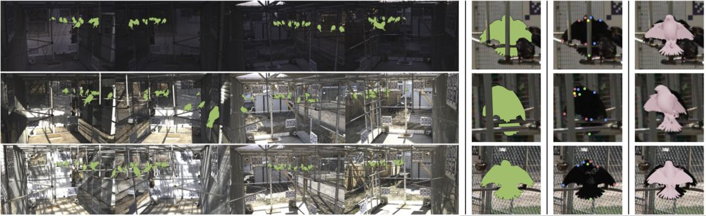

## Animal Paper Collection (Ongoing)
[2022.01.02] To make it easy to track, I sort the papers using the timepoint I find them (not publication time), and add label badges to show paper features. 

[2021.11.28] I recommend [MMPose](https://github.com/open-mmlab/mmpose) for 2D animal pose estimation. It has collected various kinds of [datasets](https://github.com/open-mmlab/mmpose/blob/master/docs/tasks/2d_animal_keypoint.md).

[2021.07.16] I recommend CV4Animal workshop in CVPR 2021 (https://www.cv4animals.com/) because it is a good collection of recent advances in animal pose estimation area! 

Recently, markerless animal **motion capture** and **3D reconstruction** attracts more and more attention in computer vision community. Inspired by remarkable techniques for markerless human motion capture, a few excellent literatures appear for animal modeling and reconstruction such as [SMAL](http://smal.is.tue.mpg.de/
) and [DeepLabCut](http://www.mousemotorlab.org/deeplabcut). However, there is still a long way before computer vision methods could capture natural motion of arbitary animals in industrial-grade. 

Therefore, I contribute this repository to track every step towards the ultimate goal of high quality animal capture. If you want to add/remove an article, please send an email to [Liang An](https://anl13.github.io/)(al17 at mails dot tsinghua dot edu dot cn). Thank all the authors for their contribution and support.

 

<table><tbody> <tr> <td align="left" width=250>
</td>
<td align="left" width=550><em>BANMo: Building Animatable 3D Neural Models from Many Casual Videos</em> 
<a href="https://gengshan-y.github.io/"><small>Gengshan Yang</small></a>, 
<a href="https://minhpvo.github.io/"><small>Minh Vo</small></a>, 
<a href="https://nneverova.github.io/"><small>Natalia Neverova</small></a>, 
<a href="https://www.cs.cmu.edu/~deva/"><small>Deva Ramanan</small></a>, 
<a href="https://www.robots.ox.ac.uk/~vedaldi/"><small>Andrea Vedaldi</small></a>, 
<a href="https://jhugestar.github.io/"><small>Hanbyul Joo</small></a> 
<small>In arxiv 2021 </small> 
 

</td></tr></tbody>

<tbody> <tr> <td align="left" width=250>
</td>
<td align="left" width=550><em>Muti-view Mouse Social Behaviour Recognition with Deep Graphic Model</em> 
<small>Zheheng Jiang</small>, 
<small>Feixiang Zhou</small>, 
<small>Aite Zhao</small>, 
<small>Xin Li</small>, 
<small>Ling Li</small>, 
<a href="https://dl.acm.org/profile/81100159571"><small>Dacheng Tao</small></a>, 
<a href="http://www.dcs.bbk.ac.uk/~xuelong/"><small>Xuelong Li</small></a>, 
<a href="https://www2.le.ac.uk/departments/informatics/people/huiyu-zhou"><small>Huiyu Zhou</small></a> 
<small>In TIP 2021 </small> 
 
</td></tr></tbody>

<tbody> <tr> <td align="left" width=250>
</td>
<td align="left" width=550><em>MouseVenue3D: A Markerless Three-Dimension Behavioral Tracking System for Matching Two-Photon Brain Imaging in Free-Moving Mice</em> 
<small>Yaning Han</small>, 
<small>Kang Huang</small>, 
<small>Ke Chen</small>, 
<small>Hongli Pan</small>, 
<small>Furong Ju</small>, 
<small>Yueyue Long</small>, 
<small>Gao Gao</small>, 
<small>Runlong Wu</small>, 
<small>Aimin Wang</small>, 
<small>Liping Wang</small>, 
Pengfei Wei 
<small>In Neuroscience Bulletin 2021 </small> 
 
</td></tr></tbody>

<tbody> <tr> <td align="left" width=250>
</td>
<td align="left" width=550><em>Multi-camera real-time threedimensional tracking of multiple flying animals</em> 
<a href="https://strawlab.org/"><small>Andrew D. Straw</small></a>, 
<small>Kristin Branson</small>, 
<small>Titus R. Neumann</small>, 
<a href="https://www.bbe.caltech.edu/people/michael-h-dickinson"><small>Michael H. Dickinson</small></a> 
<small>In J. R. Soc. Interface 2011 </small> 
 
</td></tr></tbody>

<tbody> <tr> <td align="left" width=250>
</td>
<td align="left" width=550><em>The Mouse Action Recognition System (MARS) software pipeline for automated analysis of social behaviors in mice</em> 
<small>Cristina Segalin</small>, 
<small>Jalani Williams</small>, 
<small>Tomomi Karigo</small>, 
<small>May Hui</small>, 
<small>Moriel Zelikowsky</small>, 
<small>Jennifer J Sun</small>, 
<small>Pietro Perona</small>, 
<small>David J Anderson</small>, 
Ann Kennedy 
<small>In eLife 2021 </small> 
 

</td></tr></tbody>

<tbody> <tr> <td align="left" width=250>
</td>
<td align="left" width=550><em>Self-Supervised Keypoint Discovery in Behavioral Videos</em> 
<small>Jennifer J. Sun</small>, 
<small>Serim Ryou</small>, 
<small>Roni Goldshmid</small>, 
<small>Brandon Weissbourd</small>, 
<small>John Dabiri</small>, 
<small>David J. Anderson</small>, 
<small>Ann Kennedy</small>, 
<small>Yisong Yue</small>, 
Pietro Perona 
<small>In arxiv 2021 </small> 
 
</td></tr></tbody>

<tbody> <tr> <td align="left" width=250>
</td>
<td align="left" width=550><em>The Multi-Agent Behavior Dataset: Mouse Dyadic Social Interactions</em> 
<small>Jennifer J. Sun</small>, 
<small>Tomomi Karigo</small>, 
<small>Dipam Chakraborty</small>, 
<small>Sharada P. Mohanty</small>, 
<small>David J. Anderson</small>, 
<small>Pietro Perona</small>, 
<small>Yisong Yue</small>, 
Ann Kennedy 
<small>In NeurIPS (Dataset & Benchmarks) 2021 </small> 
 

</td></tr></tbody>

<tbody> <tr> <td align="left" width=250>
</td>
<td align="left" width=550><em>Task Programming: Learning Data Efficient Behavior Representations</em> 
<small>Jennifer J. Sun</small>, 
<small>Ann Kennedy</small>, 
<small>Eric Zhan</small>, 
<small>David J. Anderson</small>, 
<small>Yisong Yue</small>, 
Pietro Perona 
<small>In CVPR 2021 </small>(<b><small>Best Student Paper Award</small></b>) 
 

</td></tr></tbody>

<tbody> <tr> <td align="left" width=250>
</td>
<td align="left" width=550><em>Coarse-to-fine Animal Pose and Shape Estimation</em> 
<a href="https://chaneyddtt.github.io/"><small>Chen Li</small></a>, 
<a href="https://www.comp.nus.edu.sg/~leegh/"><small>Gim Hee Lee</small></a> 
<small>In NeurIPS 2021 </small> 
 
</td></tr></tbody>

<tbody> <tr> <td align="left" width=250>
</td>
<td align="left" width=550><em>Hierarchical organization of rhesus macaque behavior</em> 
<small>Benjamin Voloh</small>, 
<small>Benjamin R. Eisenreich</small>, 
<small>David J-N. Maisson</small>, 
<small>R. Becket Ebitz</small>, 
<small>Hyun Soo Park</small>, 
<small>Benjamin Y. Hayden</small>, 
Jan Zimmermann 
<small>In biorxiv 2021 </small> 
 
</td></tr></tbody>

<tbody> <tr> <td align="left" width=250>
</td>
<td align="left" width=550><em>Leaving Flatland: Advances in 3D behavioral measurement</em> 
<a href="https://neurotree.org/neurotree/peopleinfo.php?pid=663448"><small>Jesse D. Marshall</small></a>, 
<small>Tianqing Li</small>, 
<small>Joshua H. Wu</small>, 
Timothy W. Dunn 
<small>In arxiv 2021 </small> 
 
</td></tr></tbody>

<tbody> <tr> <td align="left" width=250>
</td>
<td align="left" width=550><em>Unified 3D Mesh Recovery of Humans and Animals by Learning Animal Exercise</em> 
<small>Kim Youwang</small>, 
<small>Kim Ji-Yeon</small>, 
<small>Kyungdon Joo</small>, 
Tae-Hyun Oh 
<small>In BMVC 2021 </small> 
 
</td></tr></tbody>

<tbody> <tr> <td align="left" width=250>
</td>
<td align="left" width=550><em>Anipose: a toolkit for robust markerless 3D pose estimation</em> 
<a href="https://github.com/lambdaloop"><small>Pierre Karashchuk</small></a>, 
<small>Katie L. Rupp</small>, 
<small>Evyn S. Dickinson</small>, 
<small>SarahWalling-Bell</small>, 
<small>Elischa Sanders</small>, 
<a href="https://www.salk.edu/scientist/eiman-azim/"><small>Eiman Azim</small></a>, 
<a href="https://www.bingbrunton.com/"><small>Bingni W. Brunton</small></a>, 
<a href="http://faculty.washington.edu/tuthill/"><small>John C. Tuthill</small></a> 
<small>In Cell Reports (Resource) 2021 </small> 
 

</td></tr></tbody>

<tbody> <tr> <td align="left" width=250>
</td>
<td align="left" width=550><em>Multimodal-based Scene-Aware Framework for Aquatic Animal Segmentation</em> 
<small>Minh-Quan Le</small>, 
<small>Trung-Nghia Le</small>, 
<small>Tam V. Nguyen</small>, 
<small>Isao Echizen</small>, 
Minh-Triet Tran 
<small>In arxiv 2021 </small> 
 
</td></tr></tbody>

<tbody> <tr> <td align="left" width=250>
</td>
<td align="left" width=550><em>Learning interaction rules from multi-animal trajectories via augmented behavioral models</em> 
<small>Keisuke Fujii</small>, 
<small>Naoya Takeishi</small>, 
<small>Kazushi Tsutsui</small>, 
<small>Emyo Fujioka</small>, 
<small>Nozomi Nishiumi</small>, 
<small>Ryoya Tanaka</small>, 
<small>Mika Fukushiro</small>, 
<small>Kaoru Ide</small>, 
<small>Hiroyoshi Kohno</small>, 
<small>Ken Yoda</small>, 
<small>Susumu Takahashi</small>, 
<small>Shizuko Hiryu</small>, 
<a href="http://en.kawahara-lab.org/~kawahara/"><small>Yoshinobu Kawahara</small></a> 
<small>In NeurIPS 2021 </small> 
 
</td></tr></tbody>

<tbody> <tr> <td align="left" width=250>
</td>
<td align="left" width=550><em>The PAIR-R24M Dataset for Multi-animal 3D Pose Estimation</em> 
<small>Jesse Marshall</small>, 
<small>Ugne Klibaite</small>, 
<small>Amanda Gellis</small>, 
<small>Diego Aldarondo</small>, 
<a href="https://oeb.harvard.edu/people/bence-p-olveczky"><small>Bence O¨lveczky</small></a>, 
Tim Dunn 
<small>In NeurIPS 2021 </small> 
 

</td></tr></tbody>

<tbody> <tr> <td align="left" width=250>
</td>
<td align="left" width=550><em>Across-animal odor decoding by probabilistic manifold alignment</em> 
<small>Pedro Herrero-Vidal</small>, 
<small>Dmitry Rinberg</small>, 
<a href="https://as.nyu.edu/content/nyu-as/as/faculty/cristina-savin.html"><small>Cristina Savin</small></a> 
<small>In NeurIPS 2021 </small> 
 
</td></tr></tbody>

<tbody> <tr> <td align="left" width=250>
</td>
<td align="left" width=550><em>4DComplete: Non-Rigid Motion Estimation Beyond the Observable Surface</em> 
<small>Yang Li</small>, 
<small>Hikari Takehara</small>, 
<small>Takafumi Taketomi</small>, 
<small>Bo Zheng</small>, 
<a href="https://niessnerlab.org/"><small>Matthias Nießner</small></a> 
<small>In ICCV 2021 </small> 
 

</td></tr></tbody>

<tbody> <tr> <td align="left" width=250>
</td>
<td align="left" width=550><em>DensePose 3D: Lifting Canonical Surface Maps of Articulated Objects to the Third Dimension</em> 
<small>Roman Shapovalov</small>, 
<small>David Novotny</small>, 
<small>Benjamin Graham</small>, 
<small>Patrick Labatut</small>, 
Andrea Vedaldi 
<small>In ICCV 2021 </small> 
 
</td></tr></tbody>

<tbody> <tr> <td align="left" width=250>
</td>
<td align="left" width=550><em>Body language signals for rodent social communication</em> 
<small>Christian L. Ebbesen</small>, 
<a href="https://med.nyu.edu/faculty/robert-c-froemke"><small>Robert C. Froemke</small></a> 
<small>In Current Opinion in Neurobiology 2021 </small> 
 
</td></tr></tbody>

<tbody> <tr> <td align="left" width=250>
</td>
<td align="left" width=550><em>Automatic mapping of multiplexed social receptive fields by deep learning and GPU-accelerated 3D videography</em> 
<small>Christian L. Ebbesen</small>, 
<a href="http://froemkelab.med.nyu.edu/people"><small>Robert C. Froemke</small></a> 
<small>In biorxiv 2020 </small> 
 
</td></tr></tbody>

<tbody> <tr> <td align="left" width=250>
</td>
<td align="left" width=550><em>coding of facial expressions of pain in the laboratory mouse</em> 
<small>Dale J Langford</small>, 
<small>Andrea L Bailey</small>, 
<small>Mona Lisa Chanda</small>, 
<small>Sarah E Clarke</small>, 
<small>Tanya E Drummond</small>, 
<small>Stephanie Echols</small>, 
<small>Sarah Glick</small>, 
<small>Joelle Ingrao</small>, 
<small>Tammy Klassen-Ross</small>, 
<small>Michael L LaCroix-Fralish</small>, 
<small>Lynn Matsumiya</small>, 
<small>Robert E Sorge</small>, 
<small>Susana G Sotocinal</small>, 
<small>John M Tabaka</small>, 
<small>David Wong</small>, 
<small>Arn M J M van den Maagdenberg</small>, 
<small>Michel D Ferrari</small>, 
<small>Kenneth D Craig</small>, 
Jeffrey S Mogil 
<small>In Nature Methods (brief communications) 2010 </small> 
 
</td></tr></tbody>

<tbody> <tr> <td align="left" width=250>
</td>
<td align="left" width=550><em>AP-10K: A Benchmark for Animal Pose Estimation in the Wild</em> 
<small>Hang Yu</small>, 
<small>Yufei Xu</small>, 
<small>Jing Zhang</small>, 
<small>Wei Zhao</small>, 
<small>Ziyu Guan</small>, 
<a href="https://www.sydney.edu.au/engineering/about/our-people/academic-staff/dacheng-tao.html"><small>Dacheng Tao</small></a> 
<small>In NeurIPS 2021 </small> 
 

</td></tr></tbody>

<tbody> <tr> <td align="left" width=250>
</td>
<td align="left" width=550><em>DeepImageJ: A user-friendly environment to run deep learning models in ImageJ</em> 
<small>Estibaliz Gómez-de-Mariscal</small>, 
<small>Carlos García-López-de-Haro</small>, 
<small>Wei Ouyang</small>, 
<small>Laurène Donati</small>, 
<small>Emma Lundberg</small>, 
<small>Michael Unser</small>, 
<small>Arrate Muñoz-Barrutia</small>, 
<a href="https://people.epfl.ch/daniel.sage/?lang=en"><small>Daniel Sage</small></a> 
<small>In Nature Methods (brief communication) 2021 </small> 
 

</td></tr></tbody>

<tbody> <tr> <td align="left" width=250>
</td>
<td align="left" width=550><em>idtracker.ai: tracking all individuals in small or large collectives of unmarked animals</em> 
<a href="https://www.researchgate.net/profile/Francisco_Romero-Ferrero"><small>Francisco Romero-Ferrero</small></a>, 
<small>Mattia G. Bergomi</small>, 
<small>Robert C. Hinz</small>, 
<small>Francisco J. H. Heras</small>, 
<a href="http://www.neuro.fchampalimaud.org/en/person/276/"><small>Gonzalo G. de Polavieja</small></a> 
<small>In Nature Methods (Brief Communication) 2019 </small> 
 

</td></tr></tbody>

<tbody> <tr> <td align="left" width=250>
</td>
<td align="left" width=550><em>OpenMonkeyChallenge: Dataset and Benchmark Challenges for Pose Tracking of Non-human Primates</em> 
<small>Yuan Yao</small>, 
<small>Abhiraj Mohan</small>, 
<small>Eliza Bliss-Moreau</small>, 
<small>Kristine Coleman</small>, 
<small>Sienna M. Freeman</small>, 
<small>Christopher J. Machado</small>, 
<small>Jessica Raper</small>, 
<small>Jan Zimmermann</small>, 
<small>Benjamin Y. Hayden</small>, 
Hyun Soo Park 
<small>In biorxiv 2021 </small> 
 

</td></tr></tbody>

<tbody> <tr> <td align="left" width=250>
</td>
<td align="left" width=550><em>A Novel Dataset for Keypoint Detection of Quadruped Animals from Images</em> 
<small>Prianka Banik</small>, 
<small>Lin Li</small>, 
Xishuang Dong 
<small>In arxiv 2021 </small> 
 
</td></tr></tbody>

<tbody> <tr> <td align="left" width=250>
</td>
<td align="left" width=550><em>NeuroMechFly, a neuromechanical model of adult Drosophila melanogaster</em> 
<small>Victor Lobato Rios</small>, 
<small>Pembe Gizem Ozdil</small>, 
<small>Shravan Tata Ramalingasetty</small>, 
<small>Jonathan Arreguit</small>, 
<a href="https://www.epfl.ch/labs/biorob/people/ijspeert/"><small>Auke Jan Ijspeert</small></a>, 
<a href="https://people.epfl.ch/pavan.ramdya"><small>Pavan Ramdya</small></a> 
<small>In biorxiv 2021 </small> 
 

</td></tr></tbody>

<tbody> <tr> <td align="left" width=250>
</td>
<td align="left" width=550><em>Discovering Relationships between Object Categories via Universal Canonical Maps</em> 
<small>Natalia Neverova</small>, 
<small>Artsiom Sanakoyeu</small>, 
<small>Patrick Labatut</small>, 
<small>David Novotny</small>, 
<a href="https://www.robots.ox.ac.uk/~vedaldi/"><small>Andrea Vedaldi</small></a> 
<small>In CVPR 2021 </small> 
 
</td></tr></tbody>

<tbody> <tr> <td align="left" width=250>
</td>
<td align="left" width=550><em>Gait-level analysis of mouse open field behavior using deep learning-based pose estimation</em> 
<small>Keith Sheppard</small>, 
<small>Justin Gardin</small>, 
<small>Gautam Sabnis</small>, 
<small>Asaf Peer</small>, 
<small>Megan Darrell</small>, 
<small>Sean Deats</small>, 
<small>Brian Geuther</small>, 
<small>Cathleen M. Lutz</small>, 
<a href="https://www.kumarlab.org/"><small>Vivek Kumar</small></a> 
<small>In biorxiv 2020 </small> 
 
</td></tr></tbody>

<tbody> <tr> <td align="left" width=250>
</td>
<td align="left" width=550><em>LiftPose3D, a deep learning-based approach for transforming two-dimensional to three-dimensional poses in laboratory animals</em> 
<small>Adam Gosztolai</small>, 
<small>Semih Gunel</small>, 
<small>Marco Pietro Abrate</small>, 
<small>Daniel Morales</small>, 
<small>Victor Lobato Rios</small>, 
<a href="https://www.cs.ubc.ca/~rhodin/"><small>Helge Rhodin</small></a>, 
<small>Pascal Fua</small>, 
<a href="https://www.epfl.ch/labs/ramdya-lab/"><small>Pavan Ramdya</small></a> 
<small>In Nature Methods 2021 </small> 
 

</td></tr></tbody>

<tbody> <tr> <td align="left" width=250>
</td>
<td align="left" width=550><em>Geometric deep learning enables 3D kinematic profiling across species and environments</em> 
<small>Timothy W. Dunn</small>, 
<small>Jesse D. Marshall</small>, 
<small>Kyle S. Severson</small>, 
<small>Diego E. Aldarondo</small>, 
<small>David G. C. Hildebrand</small>, 
<small>Selmaan N. Chettih</small>, 
<small>William L. Wang</small>, 
<small>Amanda J. Gellis</small>, 
<small>David E. Carlson</small>, 
<small>Dmitriy Aronov</small>, 
<small>Winrich A. Freiwald</small>, 
<small>Fan Wang</small>, 
Bence P. Ölveczky 
<small>In Nature Methods 2021 </small> 
 

</td></tr></tbody>

<tbody> <tr> <td align="left" width=250>
</td>
<td align="left" width=550><em>Birds of a Feather: Capturing Avian Shape Models from Images</em> 
<a href="https://yufu-wang.github.io/"><small>Yufu Wang</small></a>, 
<a href="https://www.seas.upenn.edu/~nkolot/"><small>Nikos Kolotouros</small></a>, 
<a href="https://www.cis.upenn.edu/~kostas/"><small>Kostas Daniilidis</small></a>, 
<a href="https://www.ocf.berkeley.edu/~badger/"><small>Marc Badger</small></a> 
<small>In CVPR 2021 </small> 
 

</td></tr></tbody>

<tbody> <tr> <td align="left" width=250>
</td>
<td align="left" width=550><em>ThruTracker: Open-Source Software for 2-D and 3-D Animal Video Tracking</em> 
<small>Aaron J. Corcoran</small>, 
<small>Michael R. Schirmacher</small>, 
<small>Eric Black</small>, 
<a href="https://biomech.web.unc.edu/people/"><small>Tyson L. Hedrick</small></a> 
<small>In biorxiv 2021 </small> 
 
</td></tr></tbody>

<tbody> <tr> <td align="left" width=250>
</td>
<td align="left" width=550><em>A Hierarchical 3D-motion Learning Framework for Animal Spontaneous Behavior Mapping</em> 
<small>Kang Huang</small>, 
<small>Yaning Han</small>, 
<small>Ke Chen</small>, 
<small>Hongli Pan</small>, 
<small>Wenling Yi</small>, 
<small>Xiaoxi Li</small>, 
<small>Siyuan Liu</small>, 
<a href="http://wanglab.siat.ac.cn/wanglab_en/index.php?a=lab_members"><small>Liping Wang</small></a>, 
<a href="https://www.researchgate.net/profile/Pengfei_Wei2"><small>Pengfei Wei</small></a> 
<small>In Nature Communications 2021 </small> 
 

</td></tr></tbody>

<tbody> <tr> <td align="left" width=250>
</td>
<td align="left" width=550><em>Big behavior: challenges and opportunities in a new era of deep behavior profiling</em> 
<small>Lukas von Ziegler</small>, 
<small>Oliver Sturman</small>, 
Johannes Bohacek 
<small>In Neuropsychopharmacology 2021 </small> 
 
</td></tr></tbody>

<tbody> <tr> <td align="left" width=250>
</td>
<td align="left" width=550><em>A three-dimensional virtual mouse generates synthetic training data for behavioral analysis</em> 
<small>Luis A. Bolaños</small>, 
<small>Dongsheng Xiao</small>, 
<small>Nancy L. Ford</small>, 
<small>Jeff M. LeDue</small>, 
<small>Pankaj K. Gupta</small>, 
<small>Carlos Doebeli</small>, 
<small>Hao Hu</small>, 
<small>Helge Rhodin</small>, 
Timothy H. Murphy 
<small>In Nature Methods (Brief Communication) 2021 </small>(<b><small>cover</small></b>) 
 

</td></tr></tbody>

<tbody> <tr> <td align="left" width=250>
</td>
<td align="left" width=550><em>DeepLabStream enables closed-loop behavioral experiments using deep learning-based markerless, real-time posture detection</em> 
<small>Jens F. Schweihoff</small>, 
<small>Matvey Loshakov</small>, 
<small>Irina Pavlova</small>, 
<small>Laura Kück</small>, 
<small>Laura A. Ewell</small>, 
Martin K. Schwarz 
<small>In Communications Biology 2021 </small> 
 

</td></tr></tbody>

<tbody> <tr> <td align="left" width=250>
</td>
<td align="left" width=550><em>From Synthetic to Real: Unsupervised Domain Adaptation for Animal Pose Estimation</em> 
<a href="https://chaneyddtt.github.io/"><small>Chen Li</small></a>, 
<a href="https://www.comp.nus.edu.sg/~leegh/"><small>Gim Hee Lee</small></a> 
<small>In CVPR 2021 </small>(<b><small>oral</small></b>) 
 

</td></tr></tbody>

<tbody> <tr> <td align="left" width=250>
</td>
<td align="left" width=550><em>LASR: Learning Articulated Shape Reconstruction from a Monocular Video</em> 
<a href="https://gengshan-y.github.io/"><small>Gengshan Yang</small></a>, 
<a href="https://deqings.github.io/"><small>Deqing Sun</small></a>, 
<a href="https://varunjampani.github.io/"><small>Varun Jampani</small></a>, 
<a href="https://people.csail.mit.edu/drdaniel/"><small>Daniel Vlasic</small></a>, 
<a href="https://people.csail.mit.edu/fcole/"><small>Forrester Cole</small></a>, 
<small>Huiwen Chang</small>, 
<a href="http://www.cs.cmu.edu/~deva/"><small>Deva Ramanan</small></a>, 
<a href="https://billf.mit.edu/"><small>William T. Freeman</small></a>, 
<a href="https://people.csail.mit.edu/celiu/"><small>Ce Liu</small></a> 
<small>In CVPR 2021 </small> 
 

</td></tr></tbody>

<tbody> <tr> <td align="left" width=250>
</td>
<td align="left" width=550><em>Real-time, low-latency closed-loop feedback using markerless posture tracking</em> 
<small>Gary Kane</small>, 
<small>Gonçalo Lopes</small>, 
<small>Jonny L. Saunders</small>, 
<a href="https://www.mathislab.org/people"><small>Alexander Mathis</small></a>, 
Mackenzie W. Mathis 
<small>In eLife 2020 </small>(<b><small>Featured by Nature Methods</small></b>) 
 

</td></tr></tbody>

<tbody> <tr> <td align="left" width=250>
</td>
<td align="left" width=550><em>Dynamics of gaze control during prey capture in freely moving mice</em> 
<small>Angie M Michaiel</small>, 
<small>Elliott TT Abe</small>, 
Cristopher M Niell 
<small>In eLife 2020 </small> 
 
</td></tr></tbody>

<tbody> <tr> <td align="left" width=250>
</td>
<td align="left" width=550><em>Continuous Whole-Body 3D Kinematic Recordings across the Rodent Behavioral Repertoire</em> 
<small>Jesse D. Marshall</small>, 
<small>Diego E. Aldarondo</small>, 
<small>Timothy W. Dunn</small>, 
<small>William L. Wang</small>, 
<small>Gordon J. Berman</small>, 
<a href="https://oeb.harvard.edu/people/bence-p-olveczky"><small>Bence P. O¨lveczky</small></a> 
<small>In Neuron 2020 </small> 
 
</td></tr></tbody>

<tbody> <tr> <td align="left" width=250>
</td>
<td align="left" width=550><em>Robust mouse tracking in complex environments using neural networks</em> 
<small>Brian Q. Geuther</small>, 
<small>Sean P. Deats</small>, 
<small>Kai J. Fox</small>, 
<small>Steve A. Murray</small>, 
<small>Robert E. Braun</small>, 
<small>Jacqueline K. White</small>, 
<small>Elissa J. Chesler</small>, 
<small>Cathleen M. Lutz</small>, 
Vivek Kumar 
<small>In Communications Biology 2019 </small> 
 
</td></tr></tbody>

<tbody> <tr> <td align="left" width=250>
</td>
<td align="left" width=550><em>AlphaTracker: A Multi-Animal Tracking and Behavioral Analysis Tool</em> 
<small>Zexin Chen</small>, 
<small>Ruihan Zhang</small>, 
<small>Yu Eva Zhang</small>, 
<small>Haowen Zhou</small>, 
<small>Hao-Shu Fang</small>, 
<small>Rachel R. Rock</small>, 
<small>Aneesh Bal</small>, 
<small>Nancy Padilla-Coreano</small>, 
<small>Laurel Keyes</small>, 
<small>Kay M. Tye</small>, 
<a href="https://www.mvig.org/"><small>Cewu Lu</small></a> 
<small>In biorxiv 2020 </small> 
 

</td></tr></tbody>

<tbody> <tr> <td align="left" width=250>
</td>
<td align="left" width=550><em>Deep Graph Pose: a semi-supervised deep graphical model for improved animal pose tracking</em> 
<small>Anqi Wu</small>, 
<small>E. Kelly Buchanan</small>, 
<small>Matthew Whiteway</small>, 
<small>Michael Schartner</small>, 
<small>Guido Meijer</small>, 
<small>Jean-Paul Noel</small>, 
<small>Erica Rodriguez</small>, 
<small>Claire Everett</small>, 
<small>Amy Norovich</small>, 
<small>Evan Schaffer</small>, 
<small>Neeli Mishra</small>, 
<small>C. Daniel Salzman</small>, 
<small>Dora Angelaki</small>, 
<small>Andrés Bendesky</small>, 
<small>The International Brain Laboratory</small>, 
<small>John Cunningham</small>, 
<a href="http://www.stat.columbia.edu/~liam/"><small>Liam Paninski</small></a> 
<small>In NeurIPS 2020 </small> 
 

</td></tr></tbody>

<tbody> <tr> <td align="left" width=250>
</td>
<td align="left" width=550><em>Simple Behavioral Analysis (SimBA)-an open source toolkit for computer classification of complex social behaviors in experimental animals</em> 
<small>Simon RO Nilsson</small>, 
<small>Nastacia L. Goodwin</small>, 
<small>Jia Jie Choong</small>, 
<small>Sophia Hwang</small>, 
<small>Hayden R Wright</small>, 
<small>Zane C Norville</small>, 
<small>Xiaoyu Tong</small>, 
<small>Dayu Lin</small>, 
<small>Brandon S. Bentzley</small>, 
<small>Neir Eshel</small>, 
<small>Ryan J McLaughlin</small>, 
<a href="https://goldenneurolab.com/people"><small>Sam A. Golden</small></a> 
<small>In biorxiv 2020 </small> 
 
</td></tr></tbody>

<tbody> <tr> <td align="left" width=250>
</td>
<td align="left" width=550><em>SLEAP: Multi-animal pose tracking</em> 
<a href="https://biophysics.princeton.edu/people/talmo-pereira"><small>Talmo D. Pereira</small></a>, 
<small>Nathaniel Tabris</small>, 
<small>Junyu Li</small>, 
<small>Shruthi Ravindranath</small>, 
<small>Eleni S. Papadoyannis</small>, 
<small>Z. Yan Wang</small>, 
<small>David M. Turner</small>, 
<small>Grace McKenzie-Smith</small>, 
<small>Sarah D. Kocher</small>, 
<small>Annegret L. Falkner</small>, 
<small>Joshua W. Shaevitz</small>, 
<a href="https://murthylab.princeton.edu/mala-murthy"><small>Mala Murthy</small></a> 
<small>In biorxiv 2020 </small> 
 

</td></tr></tbody>

<tbody> <tr> <td align="left" width=250>
</td>
<td align="left" width=550><em>TRex, a fast multi-animal tracking system with markerless identification, 2D body posture estimation and visual field reconstruction</em> 
<a href="https://www.orn.mpg.de/person/45292/409958"><small>Tristan Walter</small></a>, 
<a href="http://collectivebehaviour.com/"><small>Iain D Couzin</small></a> 
<small>In biorxiv 2020 </small> 
 
</td></tr></tbody>

<tbody> <tr> <td align="left" width=250>
</td>
<td align="left" width=550><em>FreiPose: A Deep Learning Framework for Precise Animal Motion Capture in 3D Spaces</em> 
<a href="https://lmb.informatik.uni-freiburg.de/people/zimmermc/"><small>Christian Zimmermann</small></a>, 
<small>Artur Schneider</small>, 
<small>Mansour Alyahyay</small>, 
<a href="https://lmb.informatik.uni-freiburg.de/people/brox/"><small>Thomas Brox</small></a>, 
<a href="https://www.optophysiology.uni-freiburg.de/labmembers/diester/"><small>Ilka Diester</small></a> 
<small>In biorxiv 2020 </small> 
 

</td></tr></tbody>

<tbody> <tr> <td align="left" width=250>
</td>
<td align="left" width=550><em>Multiview Supervision By Registration</em> 
<small>Yilun Zhang</small>, 
<a href="https://www-users.cs.umn.edu/~hspark/"><small>Hyun Soo Park</small></a> 
<small>In WACV 2020 </small> 
 
</td></tr></tbody>

<tbody> <tr> <td align="left" width=250>
</td>
<td align="left" width=550><em>Facial expressions of emotion states and their neuronal correlates in mice</em> 
<small>Nejc Dolensek</small>, 
<small>Daniel A. Gehrlach</small>, 
<a href="https://muckrack.com/alexandra-s-klein"><small>Alexandra S. Klein</small></a>, 
<a href="https://www.neuro.mpg.de/gogolla"><small>Nadine Gogolla</small></a> 
<small>In Science 2020 </small> 
 
</td></tr></tbody>

<tbody> <tr> <td align="left" width=250>
</td>
<td align="left" width=550><em>ZooBuilder: 2D and 3D Pose Estimation for Quadrupeds Using Synthetic Data</em> 
<small>Abassin Sourou Fangbemi</small>, 
<small>Yi Fei Lu</small>, 
<small>Mao Yuan Xu</small>, 
<small>Xiao Wu Luo</small>, 
<small>Alexis Rolland</small>, 
Chedy Raissi 
<small>In SCA (ACM Siggraph/Eurographics Symposium on Computer Animation) 2020 </small> 
 
</td></tr></tbody>

<tbody> <tr> <td align="left" width=250>
</td>
<td align="left" width=550><em>A Primer on Motion Capture with Deep Learning: Principles, Pitfalls and Perspectives</em> 
<a href="http://www.people.fas.harvard.edu/~amathis/"><small>Alexander Mathis</small></a>, 
<small>Steffen Schneider</small>, 
<small>Jessy Lauer</small>, 
<a href="https://scholar.harvard.edu/mwamoroso/home"><small>Mackenzie W. Mathis</small></a> 
<small>In Neuron 2020 </small> 
 
</td></tr></tbody>

<tbody> <tr> <td align="left" width=250>
</td>
<td align="left" width=550><em>Quantifying behavior to understand the brain</em> 
<a href="https://biophysics.princeton.edu/people/talmo-pereira"><small>Talmo D. Pereira</small></a>, 
<a href="https://molbiod.princeton.edu/people/joshua-w-shaevitz"><small>Joshua W. Shaevitz</small></a>, 
<a href="htps://murthylab.princeton.edu/mala-murthy"><small>Mala Murthy</small></a> 
<small>In Nature Neuroscience 2020 </small>(<b><small>review article</small></b>) 
 
</td></tr></tbody>

<tbody> <tr> <td align="left" width=250>
</td>
<td align="left" width=550><em>EthoLoop: automated closed-loop neuroethology in naturalistic environments</em> 
<small>Ali Nourizonoz</small>, 
<small>Robert Zimmermann</small>, 
<small>Chun Lum Andy Ho</small>, 
<small>Sebastien Pellat</small>, 
<small>Yannick Ormen</small>, 
<small>Clément Prévost-Solié</small>, 
<small>Gilles Reymond</small>, 
<small>Fabien Pifferi</small>, 
<small>Fabienne Aujard</small>, 
<small>Anthony Herrel</small>, 
<a href="https://www.unige.ch/medecine/neuf/en/"><small>Daniel Huber</small></a> 
<small>In Nature Methods 2020 </small>(<b><small>cover</small></b>) 
 
</td></tr></tbody>

<tbody> <tr> <td align="left" width=250>
</td>
<td align="left" width=550><em>Automated Markerless Pose Estimation in Freely Moving Macaques using OpenMonkeyStudio</em> 
<small>Praneet C. Bala</small>, 
<small>Benjamin R. Eisenreich</small>, 
<small>Seng Bum Michael Yoo</small>, 
<small>Benjamin Y. Hayden</small>, 
<a href="https://www-users.cs.umn.edu/~hspark/"><small>Hyun Soo Park</small></a>, 
<a href="https://med.umn.edu/bio/medical-discovery-teams/jan-zimmermann"><small>Jan Zimmermann</small></a> 
<small>In Nature Communications 2020 </small> 
 

</td></tr></tbody>

<tbody> <tr> <td align="left" width=250>
</td>
<td align="left" width=550><em>3D Bird Reconstruction: a Dataset, Model, and Shape Recovery from a Single View</em> 
<a href="https://www.ocf.berkeley.edu/~badger/"><small>Marc Badger</small></a>, 
<a href="https://yufu-wang.github.io/"><small>Yufu Wang</small></a>, 
<a href="https://www.seas.upenn.edu/~adarshm/"><small>Adarsh Modh</small></a>, 
<a href="https://aperkes.github.io/"><small>Ammon Perkes</small></a>, 
<a href="https://www.seas.upenn.edu/~nkolot/"><small>Nikos Kolotouros</small></a>, 
<a href="http://pfrommer.us/"><small>Bernd Pfrommer</small></a>, 
<a href="https://web.sas.upenn.edu/marcschmidtlab/pages/people/"><small>Marc F. Schmidt</small></a>, 
<a href="https://www.cis.upenn.edu/~kostas/"><small>Kostas Daniilidis</small></a> 
<small>In ECCV 2020 </small> 
 

</td></tr></tbody>

<tbody> <tr> <td align="left" width=250>
</td>
<td align="left" width=550><em>Who Left the Dogs Out? 3D Animal Reconstruction with Expectation Maximization in the Loop</em> 
<a href="http://mi.eng.cam.ac.uk/~bjb56/"><small>Benjamin Biggs</small></a>, 
<a href="https://uk.linkedin.com/in/ollie-boyne"><small>Oliver Boyne</small></a>, 
<a href="http://www.jjcvision.com/"><small>James Charles</small></a>, 
<a href="https://www.microsoft.com/en-us/research/people/awf/"><small>Andrew Fitzgibbon</small></a>, 
<a href="https://mi.eng.cam.ac.uk/~cipolla/"><small>Roberto Cipolla</small></a> 
<small>In ECCV 2020 </small> 
 
</td></tr></tbody>

<tbody> <tr> <td align="left" width=250>
</td>
<td align="left" width=550><em>Shape and Viewpoint without Keypoints</em> 
<a href="https://people.eecs.berkeley.edu/~shubham-goel/"><small>Shubham Goel</small></a>, 
<a href="https://people.eecs.berkeley.edu/~kanazawa/"><small>Angjoo Kanazawa</small></a>, 
<a href="https://people.eecs.berkeley.edu/~malik/"><small>Jitendra Malik</small></a> 
<small>In ECCV 2020 </small> 
 

</td></tr></tbody>

<tbody> <tr> <td align="left" width=250>
</td>
<td align="left" width=550><em>Deep Cross-species Feature Learning for Animal Face Recognition via Residual Interspecies Equivariant Network</em> 
<small>Xiao Shi</small>, 
<small>Chenxue Yang</small>, 
<small>Xue Xia</small>, 
<a href="http://aii.caas.cn/bsgk/ywbm/nyxxjzsyb/xzbm3/203034.htm"><small>Xiujuan Chai</small></a> 
<small>In ECCV 2020 </small> 
 
</td></tr></tbody>

<tbody> <tr> <td align="left" width=250>
</td>
<td align="left" width=550><em>RGBD-Dog: Predicting Canine Pose from RGBD Sensors</em> 
<a href="https://researchportal.bath.ac.uk/en/persons/sinead-kearney"><small>Sinead Kearney</small></a>, 
<a href="https://wbli.me/"><small>Wenbin Li</small></a>, 
<small>Martin Parsons</small>, 
<a href="http://kimki.unist.ac.kr/"><small>Kwang In Kim</small></a>, 
<a href="http://www.cs.bath.ac.uk/~dpc/"><small>Darren Cosker</small></a> 
<small>In CVPR 2020 </small> 
 

</td></tr></tbody>

<tbody> <tr> <td align="left" width=250>
</td>
<td align="left" width=550><em>AnimalWeb: A Large-Scale Hierarchical Dataset of Annotated Animal Faces</em> 
<small>Muhammad Haris Khan</small>, 
<small>John McDonagh</small>, 
<small>Salman Khan</small>, 
<small>Muhammad Shahabuddin</small>, 
<small>Aditya Arora</small>, 
<small>Fahad Shahbaz Khan</small>, 
<small>Ling Shao</small>, 
<a href="http://www.cs.nott.ac.uk/~pszyt/"><small>Georgios Tzimiropoulos</small></a> 
<small>In CVPR 2020 </small> 
 

</td></tr></tbody>

<tbody> <tr> <td align="left" width=250>
</td>
<td align="left" width=550><em>Articulation Aware Canonical Surface Mapping</em> 
<a href="https://nileshkulkarni.github.io/"><small>Nilesh Kulkarni</small></a>, 
<a href="http://www.cs.cmu.edu/~abhinavg/"><small>Abhinav Gupta</small></a>, 
<a href="http://web.eecs.umich.edu/~fouhey/"><small>David F. Fouhey</small></a>, 
<a href="https://shubhtuls.github.io/"><small>Shubham Tulsiani</small></a> 
<small>In CVPR 2020 </small> 
 

</td></tr></tbody>

<tbody> <tr> <td align="left" width=250>
</td>
<td align="left" width=550><em>Deformation-aware Unpaired Image Translation for Pose Estimation on Laboratory Animals</em> 
<a href="https://siyliepfl.github.io/"><small>Siyuan Li</small></a>, 
<a href="https://semihgunel.com/"><small>Semih Gunel</small></a>, 
<small>Mirela Ostrek</small>, 
<small>Pavan Ramdya</small>, 
<small>Pascal Fua</small>, 
<a href="https://www.cs.ubc.ca/~rhodin/"><small>Helge Rhodin</small></a> 
<small>In CVPR 2020 </small> 
 

</td></tr></tbody>

<tbody> <tr> <td align="left" width=250>
</td>
<td align="left" width=550><em>Learning from Synthetic Animals</em> 
<small>Jiteng Mu</small>, 
<a href="https://weichaoqiu.com/"><small>Weichao Qiu</small></a>, 
<a href="https://www.cs.jhu.edu/hager/"><small>Gregory Hager</small></a>, 
<a href="http://www.cs.jhu.edu/~ayuille/"><small>Alan Yuille</small></a> 
<small>In CVPR 2020 </small>(<b><small>oral</small></b>) 
 

</td></tr></tbody>

<tbody> <tr> <td align="left" width=250>
</td>
<td align="left" width=550><em>3D-ZeF: A 3D Zebrafish Tracking Benchmark Dataset</em> 
<a href="https://vbn.aau.dk/en/persons/141158"><small>Malte Pedersen</small></a>, 
<small>Joakim Bruslund Haurum</small>, 
<a href="https://vbn.aau.dk/en/persons/138111"><small>Stefan Hein Bengtson</small></a>, 
<a href="https://vbn.aau.dk/en/persons/103282"><small>Thomas B. Moeslund</small></a> 
<small>In CVPR 2020 </small> 
 

</td></tr></tbody>

<tbody> <tr> <td align="left" width=250>
</td>
<td align="left" width=550><em>Transferring Dense Pose to Proximal Animal Classes</em> 
<a href="https://gdude.de/"><small>Artsiom Sanakoyeu</small></a>, 
<a href="https://research.fb.com/people/khalidov-vasil/"><small>Vasil Khalidov</small></a>, 
<a href="https://www.maureenmccarthyphd.com/"><small>Maureen S. McCarthy</small></a>, 
<a href="https://www.robots.ox.ac.uk/~vedaldi/"><small>Andrea Vedaldi</small></a>, 
<a href="https://nneverova.github.io/"><small>Natalia Neverova</small></a> 
<small>In CVPR 2020 </small> 
 

</td></tr></tbody>

<tbody> <tr> <td align="left" width=250>
</td>
<td align="left" width=550><em>Unsupervised Learning of Probably Symmetric Deformable 3D Objects from Images in the Wild</em> 
<a href="https://elliottwu.com/"><small>Shangzhe Wu</small></a>, 
<a href="https://chrirupp.github.io/"><small>Christian Rupprecht</small></a>, 
<a href="http://www.robots.ox.ac.uk/~vedaldi/"><small>Andrea Vedaldi</small></a> 
<small>In CVPR 2020 </small>(<b><small>Best Paper Award</small></b>) 
 

</td></tr></tbody>

<tbody> <tr> <td align="left" width=250>
</td>
<td align="left" width=550><em>DeepPoseKit, a software toolkit for fast and robust animal pose estimation using deep learning</em> 
<a href="https://jakegraving.com/files/cv/jacob_graving_cv.pdf"><small>Jacob M. Graving</small></a>, 
<a href="https://www.danielchae.com/"><small>Daniel Chae</small></a>, 
<small>Hemal Naik</small>, 
<small>Liang Li</small>, 
<small>Benjamin Koger</small>, 
<a href="http://www.blaircostelloe.com/"><small>Blair R. Costelloe</small></a>, 
<a href="http://collectivebehaviour.com/people/couzin-iain/#:~:text=Iain%20Couzin%20is%20Director%20of%20the%20Max%20Planck,Fellow%20in%20the%20Sciences%20at%20Balliol%20College%2C%20Oxford."><small>Iain D. Couzin</small></a> 
<small>In eLife 2019 </small> 
 

</td></tr></tbody>

<tbody> <tr> <td align="left" width=250>
</td>
<td align="left" width=550><em>Using DeepLabCut for 3D markerless pose estimation across species and behaviors</em> 
<small>Tanmay Nath</small>, 
<a href="http://www.people.fas.harvard.edu/~amathis/"><small>Alexander Mathis</small></a>, 
<small>An Chi Chen</small>, 
<small>Amir Patel</small>, 
<a href="http://bethgelab.org/"><small>Matthias Bethge</small></a>, 
<a href="https://scholar.harvard.edu/mwamoroso/home"><small>Mackenzie Weygandt Mathis</small></a> 
<small>In Nature Protocols 2019 </small>(<b><small>cover</small></b>) 
 

</td></tr></tbody>

<tbody> <tr> <td align="left" width=250>
</td>
<td align="left" width=550><em>Fast animal pose estimation using deep neural networks</em> 
<a href="https://biophysics.princeton.edu/people/talmo-pereira"><small>Talmo D. Pereira</small></a>, 
<a href="https://olveczkylab.oeb.harvard.edu/people/diego-etiony-aldarondo"><small>Diego E. Aldarondo</small></a>, 
<small>Lindsay Willmore</small>, 
<a href="Mikhail Kislin"><small>Mikhail Kislin</small></a>, 
<a href="https://scholar.princeton.edu/wanglab/people/samuel-s-h-wang"><small>Samuel S.-H. Wang</small></a>, 
<a href="https://murthylab.princeton.edu/mala-murthy"><small>Mala Murthy</small></a>, 
<a href="https://molbiod.princeton.edu/people/joshua-w-shaevitz"><small>Joshua W. Shaevitz</small></a> 
<small>In Nature Methods 2019 </small> 
 

</td></tr></tbody>

<tbody> <tr> <td align="left" width=250>
</td>
<td align="left" width=550><em>Real-time analysis of the behaviour of groups of mice via a depth-sensing camera and machine learning</em> 
<a href="https://research.pasteur.fr/en/member/fabrice-de-chaumont/"><small>Fabrice de Chaumont</small></a>, 
<small>Elodie Ey</small>, 
<small>Nicolas Torquet</small>, 
<small>Thibault Lagache</small>, 
<small>Stéphane Dallongeville</small>, 
<small>Albane Imbert</small>, 
<small>Thierry Legou</small>, 
<small>Anne-Marie Le Sourd</small>, 
<small>Philippe Faure</small>, 
<a href="https://research.pasteur.fr/en/member/thomas-bourgeron/"><small>Thomas Bourgeron</small></a>, 
<a href="https://research.pasteur.fr/en/member/jean-christophe-olivo-marin/"><small>Jean-Christophe Olivo-Marin</small></a> 
<small>In Nature Biomedical Engineering 2019 </small> 
 

</td></tr></tbody>

<tbody> <tr> <td align="left" width=250>
</td>
<td align="left" width=550><em>Cross-Domain Adaptation for Animal Pose Estimation</em> 
<a href="http://www.jinkuncao.com/"><small>Jinkun Cao</small></a>, 
<small>Hongyang Tang</small>, 
<a href="https://fang-haoshu.github.io/"><small>Hao-Shu Fang</small></a>, 
<a href="http://xiaoyongshen.me/"><small>Xiaoyong Shen</small></a>, 
<a href="https://www.mvig.org/"><small>Cewu Lu</small></a>, 
Yu-Wing Tai 
<small>In ICCV 2019 </small>(<b><small>oral</small></b>) 
 

</td></tr></tbody>

<tbody> <tr> <td align="left" width=250>
</td>
<td align="left" width=550><em>Canonical Surface Mapping via Geometric Cycle Consistency</em> 
<a href="https://nileshkulkarni.github.io/"><small>Nilesh Kulkarni</small></a>, 
<a href="http://www.cs.cmu.edu/~abhinavg/"><small>Abhinav Gupta</small></a>, 
<a href="https://shubhtuls.github.io/"><small>Shubham Tulsiani</small></a> 
<small>In ICCV 2019 </small> 
 

</td></tr></tbody>

<tbody> <tr> <td align="left" width=250>
</td>
<td align="left" width=550><em>MONET: Multiview Semi-supervised Keypoint Detection via Epipolar Divergence</em> 
<small>Yuan Yao</small>, 
<small>Yasamin Jafarian</small>, 
<a href="https://www-users.cs.umn.edu/~hspark/"><small>Hyun Soo Park</small></a> 
<small>In ICCV 2019 </small> 
 
</td></tr></tbody>

<tbody> <tr> <td align="left" width=250>
</td>
<td align="left" width=550><em>Three-D Safari: Learning to Estimate Zebra Pose, Shape, and Texture from Images "In the Wild"</em> 
<a href="https://ps.is.tuebingen.mpg.de/person/szuffi"><small>Silvia Zuffi</small></a>, 
<a href="https://people.eecs.berkeley.edu/~kanazawa/"><small>Angjoo Kanazawa</small></a>, 
<a href="https://www.cs.uic.edu/~tanyabw/"><small>Tanya Berger-Wolf</small></a>, 
<a href="https://ps.is.tuebingen.mpg.de/person/black"><small>Michael J. Black</small></a> 
<small>In ICCV 2019 </small> 
 

</td></tr></tbody>

<tbody> <tr> <td align="left" width=250>
</td>
<td align="left" width=550><em>DeepLabCut: markerless pose estimation of user-defined body parts with deep learning</em> 
<a href="http://www.people.fas.harvard.edu/~amathis/"><small>Alexander Mathis</small></a>, 
<small>Pranav Mamidanna</small>, 
<a href="https://muckrack.com/kevin-m-cury"><small>Kevin M. Cury</small></a>, 
<small>Taiga Abe</small>, 
<a href="https://vnmurthylab.org/"><small>Venkatesh N. Murthy</small></a>, 
<a href="https://scholar.harvard.edu/mwamoroso/home"><small>Mackenzie Weygandt Mathis</small></a>, 
<a href="http://bethgelab.org/"><small>Matthias Bethge</small></a> 
<small>In Nature Neuroscience 2018 </small> 
 

</td></tr></tbody>

<tbody> <tr> <td align="left" width=250>
</td>
<td align="left" width=550><em>Learning Category-Specific Mesh Reconstruction from Image Collections</em> 
<a href="https://people.eecs.berkeley.edu/~kanazawa/"><small>Angjoo Kanazawa</small></a>, 
<a href="https://shubhtuls.github.io/"><small>Shubham Tulsiani</small></a>, 
<a href="https://people.eecs.berkeley.edu/~efros/"><small>Alexei A. Efros</small></a>, 
<a href="https://people.eecs.berkeley.edu/~malik/"><small>Jitendra Malik</small></a> 
<small>In ECCV 2018 </small> 
 

</td></tr></tbody>

<tbody> <tr> <td align="left" width=250>
</td>
<td align="left" width=550><em>Lions and Tigers and Bears: Capturing Non-Rigid, 3D, Articulated Shape from Images</em> 
<a href="https://ps.is.tuebingen.mpg.de/person/szuffi"><small>Silvia Zuffi</small></a>, 
<a href="https://people.eecs.berkeley.edu/~kanazawa/"><small>Angjoo Kanazawa</small></a>, 
<a href="https://ps.is.tuebingen.mpg.de/person/black"><small>Michael J. Black</small></a> 
<small>In CVPR 2018 </small>(<b><small>spotlight</small></b>) 
 

</td></tr></tbody>

<tbody> <tr> <td align="left" width=250>
</td>
<td align="left" width=550><em>Creatures great and SMAL: Recovering the shape and motion of animals from video</em> 
<a href="http://mi.eng.cam.ac.uk/~bjb56/"><small>Benjamin Biggs</small></a>, 
<a href="http://mi.eng.cam.ac.uk/~tr346/"><small>Thomas Roddick</small></a>, 
<a href="https://www.microsoft.com/en-us/research/people/awf/"><small>Andrew Fitzgibbon</small></a>, 
<a href="https://mi.eng.cam.ac.uk/~cipolla/"><small>Roberto Cipolla</small></a> 
<small>In ACCV 2018 </small>(<b><small>oral</small></b>) 
 
</td></tr></tbody>

<tbody> <tr> <td align="left" width=250>
</td>
<td align="left" width=550><em>An unsupervised method for quantifying the behavior of paired animals</em> 
<small>Ugne Klibaite</small>, 
<small>Gordon J Berman</small>, 
<small>Jessica Cande</small>, 
<small>David L Stern</small>, 
<a href="https://molbio.princeton.edu/people/joshua-w-shaevitz"><small>Joshua W Shaevitz</small></a> 
<small>In Physical Biology 2017 </small> 
 
</td></tr></tbody>

<tbody> <tr> <td align="left" width=250>
</td>
<td align="left" width=550><em>Single-View 3D Reconstruction of Animals</em> 
<a href="https://people.eecs.berkeley.edu/~kanazawa/"><small>Angjoo Kanazawa</small></a> 
<small>In Ph.D Thesis 2017 </small> 
 
</td></tr></tbody>

<tbody> <tr> <td align="left" width=250>
</td>
<td align="left" width=550><em>3D Menagerie: Modeling the 3D shape and pose of animals</em> 
<a href="https://ps.is.tuebingen.mpg.de/person/szuffi"><small>Silvia Zuffi</small></a>, 
<a href="https://people.eecs.berkeley.edu/~kanazawa/"><small>Angjoo Kanazawa</small></a>, 
<a href="https://www.cs.umd.edu/~djacobs/"><small>David W. Jacobs</small></a>, 
<a href="https://ps.is.tuebingen.mpg.de/person/black"><small>Michael J. Black</small></a> 
<small>In CVPR 2017 </small>(<b><small>spotlight</small></b>) 
 

</td></tr></tbody>

<tbody> <tr> <td align="left" width=250>
</td>
<td align="left" width=550><em>3D Pose Estimation of Flying Animals in Multi-view Video Datasets</em> 
<a href="http://people.bu.edu/breslav/"><small>Mikhail Breslav</small></a> 
<small>In Ph.D Thesis 2016 </small> 
 
</td></tr></tbody>

<tbody> <tr> <td align="left" width=250>
</td>
<td align="left" width=550><em>Learning 3D Deformation of Animals from 2D Images</em> 
<a href="https://people.eecs.berkeley.edu/~kanazawa/"><small>Angjoo Kanazawa</small></a>, 
<a href="https://shaharkov.github.io/"><small>Shahar Kovalsky</small></a>, 
<a href="http://www.weizmann.ac.il/math/ronen/home"><small>Ronen Basri</small></a>, 
<a href="https://www.cs.umd.edu/~djacobs/"><small>David W. Jacobs</small></a> 
<small>In Eurographics 2016 </small>(<b><small>Günter Enderle Best Paper Award</small></b>) 
 

</td></tr></tbody>

<tbody> <tr> <td align="left" width=250>
</td>
<td align="left" width=550><em>idTracker: Tracking individuals in a group by automatic identification of unmarked animals</em> 
<small>Alfonso Pérez-Escudero</small>, 
<small>Julián Vicente-Page</small>, 
<small>Robert C Hinz</small>, 
<small>Sara Arganda</small>, 
<a href="http://www.neuro.fchampalimaud.org/en/person/276/"><small>Gonzalo G de Polavieja1</small></a> 
<small>In Nature Methods 2014 </small> 
 

</td></tr></tbody>

</table>
 

Last updated in Jan 2022
 

This repository is inspired by [Cat Papers](https://github.com/junyanz/CatPapers) with some code borrowed from it. Paper and project signs are taken from [http://kesen.realtimerendering.com/](http://kesen.realtimerendering.com/). 